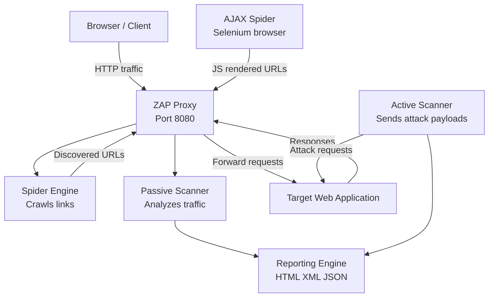
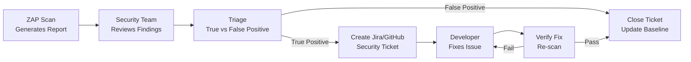
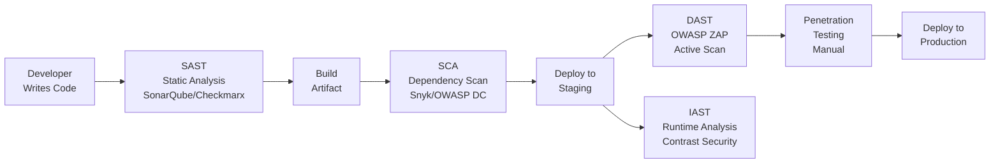

# OWASP ZAP — Complete Guide
### For Security Engineers, DevOps Engineers & DevSecOps Teams

---

## Table of Contents

1. [Introduction](#introduction)
2. [Features](#features)
3. [Installation](#installation)
4. [Starting ZAP](#starting-zap)
5. [ZAP Architecture](#zap-architecture)
6. [Scanning a URL](#scanning-a-url)
7. [Vulnerabilities Detected by ZAP](#vulnerabilities-detected-by-zap)
8. [CSP Detection Using ZAP](#csp-detection-using-zap)
9. [ZAP CLI Usage](#zap-cli-usage)
10. [Docker-based Scanning](#docker-based-scanning)
11. [CI/CD Integration](#cicd-integration)
12. [Automated Security Testing](#automated-security-testing)
13. [Generating Reports](#generating-reports)
14. [Understanding Scan Results](#understanding-scan-results)
15. [False Positives](#false-positives)
16. [Remediation Workflow](#remediation-workflow)
17. [Best Practices](#best-practices)
18. [Limitations of ZAP](#limitations-of-zap)
19. [Production Security Testing Strategy](#production-security-testing-strategy)

---

## Introduction

### What is OWASP ZAP?

OWASP ZAP (Zed Attack Proxy) is the world's most widely used open-source web application security scanner. Maintained by the Open Web Application Security Project (OWASP), ZAP is a Dynamic Application Security Testing (DAST) tool that actively probes running web applications for vulnerabilities.

```
ZAP sits between your browser and your web application:

Browser → ZAP Proxy → Web Application
                ↑
         Intercepts all traffic
         Analyzes requests and responses
         Identifies security issues
         Reports vulnerabilities
```

ZAP can be used as:
- An intercepting proxy for manual testing
- An automated scanner in CI/CD pipelines
- An API testing tool
- A regression security testing framework

### Why Organizations Use It

```
Free and open source:
  No license cost
  Community supported
  Continuously updated

OWASP backed:
  Industry standard
  Aligns with OWASP Top 10
  Trusted by security teams globally

CI/CD ready:
  Docker images available
  Command-line interface
  API for automation
  GitHub Actions integration

Comprehensive coverage:
  Passive and active scanning
  Spider and AJAX spider
  Authentication support
  API testing (OpenAPI, SOAP, GraphQL)
```

### Comparison with Commercial Scanners

| Feature | OWASP ZAP | Burp Suite Pro | Nessus Web |
|---------|-----------|----------------|------------|
| Cost | Free | $449/year | $3000+/year |
| Open Source | ✅ Yes | ❌ No | ❌ No |
| CI/CD Integration | ✅ Excellent | ✅ Good | ⚠️ Limited |
| Active Scanning | ✅ Yes | ✅ Yes | ✅ Yes |
| Passive Scanning | ✅ Yes | ✅ Yes | ✅ Yes |
| AJAX Spider | ✅ Yes | ✅ Yes | ❌ Limited |
| API Testing | ✅ Yes | ✅ Yes | ⚠️ Basic |
| GUI | ✅ Yes | ✅ Yes | ✅ Yes |
| CLI | ✅ Excellent | ⚠️ Limited | ⚠️ Limited |
| Docker | ✅ Official images | ❌ No | ❌ No |
| Community | Large | Large | Medium |
| False Positive Rate | Medium | Low | Medium |

---

## Features

### Passive Scan

Passive scanning analyzes HTTP traffic without sending additional requests. It observes requests and responses as they pass through the proxy and identifies issues that are visible in the traffic itself.

```
What passive scan finds:
  Missing security headers (CSP, HSTS, X-Frame-Options)
  Cookie security flags (Secure, HttpOnly, SameSite)
  Information disclosure in headers (Server version, X-Powered-By)
  Insecure content (HTTP resources on HTTPS page)
  Verbose error messages
  Private IP addresses in responses
```

Passive scanning is safe to run against production — it never modifies requests.

### Active Scan

Active scanning sends crafted attack payloads to the application to find vulnerabilities.

```
What active scan finds:
  SQL Injection
  Cross-Site Scripting (XSS)
  Path Traversal
  Remote Code Execution
  Command Injection
  XML/JSON Injection
  LDAP Injection
  Server-Side Request Forgery (SSRF)
```

**Warning:** Active scanning is intrusive. Only run against environments you own or have explicit permission to test. Never against production without written authorization.

### Spider

The traditional Spider crawls the application by following links in HTML responses — anchor tags, form actions, redirects.

```
Spider process:
  Start URL → find all links → follow each link
  → find more links → follow those
  → builds complete map of application
  → discovers all pages and endpoints
```

Limitation: Cannot handle JavaScript-rendered content.

### AJAX Spider

The AJAX Spider uses a real browser (via Selenium) to crawl modern single-page applications (SPAs) that load content dynamically via JavaScript.

```
AJAX Spider process:
  Launch real browser
  Navigate to start URL
  Execute JavaScript
  Wait for dynamic content
  Follow all discovered links
  Handles React, Angular, Vue apps ✅
```

### Authentication Testing

ZAP supports testing authenticated areas of applications:

```
Authentication methods supported:
  Form-based authentication (username/password form)
  HTTP Basic authentication
  HTTP Digest authentication
  NTLM authentication
  Script-based authentication (custom flows)
  JSON authentication
  OAuth 2.0 (via scripts)
```

### API Testing

ZAP can import API definitions and test all endpoints:

```
Supported formats:
  OpenAPI / Swagger (2.0 and 3.0)
  SOAP WSDL
  GraphQL
  Postman collections (via add-on)
```

### Reporting

ZAP generates reports in multiple formats suitable for developers, management, and compliance:

- HTML (human readable, color coded by severity)
- XML (machine readable, for integration)
- JSON (API friendly)
- Markdown
- PDF (via add-on)

---

## Installation

### Linux — Ubuntu

```bash
# Method 1 — Download directly
wget https://github.com/zaproxy/zaproxy/releases/download/v2.14.0/ZAP_2.14.0_Linux.tar.gz
tar -xzf ZAP_2.14.0_Linux.tar.gz
cd ZAP_2.14.0
./zap.sh

# Method 2 — Snap
sudo snap install zaproxy --classic

# Method 3 — via apt (may not be latest)
sudo apt update
sudo apt install zaproxy

# Verify installation
zaproxy --version
```

### Linux — RHEL/CentOS

```bash
# Download RPM or use tar.gz
wget https://github.com/zaproxy/zaproxy/releases/download/v2.14.0/ZAP_2.14.0_Linux.tar.gz
tar -xzf ZAP_2.14.0_Linux.tar.gz

# Install Java dependency if needed
sudo yum install java-17-openjdk

# Run ZAP
cd ZAP_2.14.0
./zap.sh
```

### Windows

```powershell
# Download installer from:
# https://github.com/zaproxy/zaproxy/releases

# Or using winget
winget install ZAP

# Or using Chocolatey
choco install zap

# Run from Start Menu or:
"C:\Program Files\OWASP\Zed Attack Proxy\ZAP.exe"
```

### macOS

```bash
# Download dmg from:
# https://github.com/zaproxy/zaproxy/releases

# Or using Homebrew
brew install --cask owasp-zap

# Run from Applications or:
open /Applications/OWASP\ ZAP.app
```

### Docker

```bash
# Pull the stable image
docker pull ghcr.io/zaproxy/zaproxy:stable

# Pull specific version
docker pull ghcr.io/zaproxy/zaproxy:2.14.0

# Verify image
docker images | grep zaproxy

# Quick test run
docker run --rm ghcr.io/zaproxy/zaproxy:stable zap.sh -version
```

---

## Starting ZAP

### GUI Mode

```bash
# Start ZAP GUI
./zap.sh

# Start with specific port
./zap.sh -port 8081

# Start with API key disabled (dev only)
./zap.sh -config api.disablekey=true
```

### Headless/Daemon Mode

```bash
# Start ZAP as a daemon (no GUI)
./zap.sh -daemon -port 8080 -config api.addrs.addr.name=.* -config api.addrs.addr.regex=true

# ZAP API now accessible at:
# http://localhost:8080/
```

### Configure Browser Proxy

```
In your browser:
  Proxy: localhost
  Port:  8080

Chrome: Settings → Advanced → System → Open proxy settings
Firefox: Settings → Network Settings → Manual proxy
```

---

## ZAP Architecture



### Components Explained

**Proxy** — The core component. All traffic passes through it. Intercepts, logs, and analyzes every request and response.

**Scanner (Passive)** — Analyzes traffic in the proxy without sending additional requests. Finds issues visible in normal traffic.

**Spider** — Discovers pages by following links. Builds the site map.

**Attack Engine (Active Scanner)** — Takes discovered pages and attacks them with security payloads. Finds vulnerabilities by triggering them.

**Reporting Engine** — Aggregates all findings and generates reports in the requested format.

---

## Scanning a URL

### Complete Scan Workflow for https://example.com

#### Step 1 — Passive Scan

```bash
# Start ZAP daemon
docker run -d \
  -p 8080:8080 \
  ghcr.io/zaproxy/zaproxy:stable \
  zap.sh -daemon \
  -port 8080 \
  -config api.disablekey=true

# Run passive scan via API
curl "http://localhost:8080/JSON/ascan/action/scan/?url=https://example.com"

# Wait for spider to complete
curl "http://localhost:8080/JSON/spider/view/status/"
# When status = 100, spider complete

# Check passive scan alerts
curl "http://localhost:8080/JSON/alert/view/alerts/?baseurl=https://example.com"
```

#### Step 2 — Active Scan

```bash
# Start active scan
curl "http://localhost:8080/JSON/ascan/action/scan/?url=https://example.com&recurse=true&inScopeOnly=false"

# Get scan ID from response
# Monitor progress
curl "http://localhost:8080/JSON/ascan/view/status/?scanId=0"
# When status = 100, scan complete

# Get all alerts
curl "http://localhost:8080/JSON/alert/view/alerts/" > alerts.json
```

#### Step 3 — Generate Report

```bash
# HTML report
curl "http://localhost:8080/OTHER/core/other/htmlreport/" > zap-report.html

# XML report
curl "http://localhost:8080/OTHER/core/other/xmlreport/" > zap-report.xml

# JSON report
curl "http://localhost:8080/JSON/alert/view/alerts/" > zap-report.json

# Open report
open zap-report.html
```

---

## Vulnerabilities Detected by ZAP

### Missing CSP

```
Alert: Content Security Policy (CSP) Header Not Set
Risk: Medium
Confidence: High

Description:
  The HTTP response did not include a
  Content-Security-Policy header

Evidence:
  No Content-Security-Policy header found
  in HTTP response headers

Solution:
  Add Content-Security-Policy header
  to all HTTP responses
```

### Missing HSTS

```
Alert: Strict-Transport-Security Header Not Set
Risk: Low
Confidence: High

Description:
  HSTS header not present
  Browser may allow HTTP connections
  Man-in-the-middle attack possible

Solution:
  Add: Strict-Transport-Security: max-age=31536000; includeSubDomains
```

### Missing X-Frame-Options

```
Alert: X-Frame-Options Header Not Set
Risk: Medium
Confidence: Medium

Description:
  Page can be embedded in iframes
  Clickjacking attack possible

Solution:
  Add: X-Frame-Options: DENY
  OR use CSP: frame-ancestors 'none'
```

### XSS (Cross-Site Scripting)

```
Alert: Cross Site Scripting (Reflected)
Risk: High
Confidence: Medium

Description:
  Input parameter reflected in response
  without proper encoding
  Attack payload executed in browser

Evidence:
  Parameter: search
  Payload: <script>alert(1);</script>
  Response contains: <script>alert(1);</script>
```

### SQL Injection Indicators

```
Alert: SQL Injection
Risk: High
Confidence: Medium

Description:
  Application may be vulnerable to SQL Injection
  Error messages suggest database query construction
  with user input

Evidence:
  Parameter: id
  Payload: ' OR '1'='1
  Response: MySQL error: You have an error in your SQL syntax
```

### Directory Traversal

```
Alert: Path Traversal
Risk: Medium
Confidence: Medium

Description:
  Application may allow file path traversal
  Attacker could read sensitive files

Evidence:
  Payload: ../../../../etc/passwd
  Response contains: root:x:0:0:root
```

### Information Disclosure

```
Alert: Server Leaks Version Information
Risk: Low
Confidence: High

Evidence:
  Server: Apache/2.4.41 (Ubuntu)
  X-Powered-By: PHP/7.4.3

Solution:
  Remove or obfuscate version information
  from server headers
```

### Cookie Security Issues

```
Alert: Cookie Without Secure Flag
Risk: Low
Confidence: Medium

Alert: Cookie Without HttpOnly Flag
Risk: Low
Confidence: Medium

Alert: Cookie Without SameSite Attribute
Risk: Low
Confidence: Medium

Solution:
  Set-Cookie: session=abc123;
    Secure;
    HttpOnly;
    SameSite=Strict;
    Path=/;
```

### Insecure Headers

```
Alerts for missing or weak headers:
  X-Content-Type-Options: nosniff       — missing
  Referrer-Policy                        — missing
  Permissions-Policy                     — missing
  Cache-Control on sensitive pages       — missing
```

---

## CSP Detection Using ZAP

### How ZAP Identifies Missing CSP

ZAP's passive scanner checks every HTTP response for the `Content-Security-Policy` header. If absent, it raises an alert.

```
ZAP passive scan process for CSP:
  1. Request made to target URL
  2. Response received
  3. Passive scanner analyzes headers
  4. Check: Content-Security-Policy present?
  5. NO → raise Medium risk alert
  6. YES → analyze policy for weaknesses
```

### How ZAP Evaluates Weak CSP Policies

ZAP checks for common CSP weaknesses:

```
Weakness 1 — wildcard in script-src:
  script-src *
  ZAP flags: "Wildcard Directive"
  Risk: High — allows scripts from anywhere

Weakness 2 — unsafe-inline:
  script-src 'self' 'unsafe-inline'
  ZAP flags: "script-src unsafe-inline"
  Risk: Medium — XSS protection bypassed

Weakness 3 — unsafe-eval:
  script-src 'self' 'unsafe-eval'
  ZAP flags: "script-src unsafe-eval"
  Risk: Medium — eval() allowed

Weakness 4 — missing object-src:
  No object-src defined
  Falls back to default-src
  ZAP flags if default-src is weak

Weakness 5 — http: allowed:
  img-src http:
  ZAP flags: insecure protocol allowed
```

### Sample ZAP CSP Findings

```json
{
  "alert": "Content Security Policy (CSP) Header Not Set",
  "risk": "Medium",
  "confidence": "High",
  "url": "https://example.com/",
  "param": "",
  "evidence": "",
  "description": "Content Security Policy (CSP) is an added layer of security that helps to detect and mitigate certain types of attacks, including Cross Site Scripting (XSS) and data injection attacks.",
  "solution": "Ensure that your web server, application server, load balancer, etc. is configured to set the Content-Security-Policy header.",
  "reference": "https://developer.mozilla.org/en-US/docs/Web/HTTP/CSP",
  "cweid": "693",
  "wascid": "15"
}
```

### Severity Levels

| Severity | Color | Meaning |
|----------|-------|---------|
| High | 🔴 Red | Critical vulnerabilities — fix immediately |
| Medium | 🟠 Orange | Significant risk — fix before production |
| Low | 🟡 Yellow | Minor issues — fix in next release |
| Informational | 🔵 Blue | Observations — review and decide |
| False Positive | ⚪ White | Mark and exclude from reports |

---

## ZAP CLI Usage

### Basic CLI Commands

```bash
# Run baseline scan (passive only — safe for production)
./zap.sh -cmd -quickurl https://example.com -quickout report.html

# Full scan with active scanning
./zap.sh -cmd \
  -quickurl https://example.com \
  -quickout /tmp/report.html \
  -quickprogress

# Daemon mode with API
./zap.sh -daemon -port 8080

# Spider a URL
./zap.sh -cmd \
  -spider https://example.com \
  -host 0.0.0.0 \
  -port 8080

# Run with specific config
./zap.sh -cmd \
  -configfile /path/to/config.properties \
  -quickurl https://example.com
```

### ZAP API via CLI

```bash
# Trigger spider via API
curl "http://localhost:8080/JSON/spider/action/scan/?url=https://example.com"

# Trigger active scan
curl "http://localhost:8080/JSON/ascan/action/scan/?url=https://example.com"

# Get scan status
curl "http://localhost:8080/JSON/ascan/view/status/"

# Get alerts
curl "http://localhost:8080/JSON/alert/view/alerts/"

# Generate HTML report
curl "http://localhost:8080/OTHER/core/other/htmlreport/" > report.html

# Shutdown ZAP
curl "http://localhost:8080/JSON/core/action/shutdown/"
```

---

## Docker-based Scanning

### Baseline Scan (Passive — Safe)

```bash
# Baseline scan — passive only
# Safe to run against production
docker run --rm \
  -v $(pwd):/zap/wrk/:rw \
  ghcr.io/zaproxy/zaproxy:stable \
  zap-baseline.py \
  -t https://example.com \
  -r baseline-report.html \
  -J baseline-report.json

# With fail on risk level
# Fail if any Medium or higher found
docker run --rm \
  ghcr.io/zaproxy/zaproxy:stable \
  zap-baseline.py \
  -t https://example.com \
  -l Medium
```

### Full Scan (Active — Not for Production)

```bash
# Full scan with active scanning
# NEVER run against production without authorization
docker run --rm \
  -v $(pwd)/reports:/zap/wrk/:rw \
  ghcr.io/zaproxy/zaproxy:stable \
  zap-full-scan.py \
  -t https://staging.example.com \
  -r full-scan-report.html \
  -J full-scan-report.json \
  -l Medium
```

### API Scan

```bash
# Scan REST API using OpenAPI spec
docker run --rm \
  -v $(pwd):/zap/wrk/:rw \
  ghcr.io/zaproxy/zaproxy:stable \
  zap-api-scan.py \
  -t https://api.example.com/openapi.json \
  -f openapi \
  -r api-scan-report.html

# Scan SOAP API
docker run --rm \
  -v $(pwd):/zap/wrk/:rw \
  ghcr.io/zaproxy/zaproxy:stable \
  zap-api-scan.py \
  -t https://api.example.com/wsdl \
  -f soap \
  -r soap-scan-report.html
```

### Docker Compose for Persistent ZAP

```yaml
# docker-compose.yml
version: '3.8'

services:
  zap:
    image: ghcr.io/zaproxy/zaproxy:stable
    ports:
      - "8080:8080"
    command: zap.sh -daemon -port 8080
      -config api.disablekey=true
      -config api.addrs.addr.name=.*
      -config api.addrs.addr.regex=true
    volumes:
      - ./zap-reports:/zap/wrk/
    restart: unless-stopped
```

---

## CI/CD Integration

### Jenkins

```groovy
// Jenkinsfile — ZAP security scan stage
pipeline {
    agent any

    stages {
        stage('Build') {
            steps {
                sh 'mvn clean package'
            }
        }

        stage('Deploy to Staging') {
            steps {
                sh './deploy-staging.sh'
                sh 'sleep 30' // wait for app to start
            }
        }

        stage('OWASP ZAP Baseline Scan') {
            steps {
                script {
                    // Run ZAP baseline scan
                    sh '''
                        docker run --rm \
                          -v ${WORKSPACE}/zap-reports:/zap/wrk/:rw \
                          ghcr.io/zaproxy/zaproxy:stable \
                          zap-baseline.py \
                          -t https://staging.example.com \
                          -r zap-baseline-report.html \
                          -J zap-baseline-report.json \
                          -l Medium \
                          || true
                    '''
                }
            }
            post {
                always {
                    // Publish HTML report
                    publishHTML(target: [
                        reportDir: 'zap-reports',
                        reportFiles: 'zap-baseline-report.html',
                        reportName: 'ZAP Security Report'
                    ])

                    // Archive JSON report
                    archiveArtifacts artifacts: 'zap-reports/zap-baseline-report.json'
                }
            }
        }

        stage('Check Security Results') {
            steps {
                script {
                    def report = readJSON file: 'zap-reports/zap-baseline-report.json'
                    def highRisk = report.site[0].alerts.findAll { it.riskcode >= 3 }

                    if (highRisk.size() > 0) {
                        error "Found ${highRisk.size()} high risk vulnerabilities!"
                    }
                }
            }
        }
    }
}
```

### GitHub Actions

```yaml
# .github/workflows/security-scan.yml
name: OWASP ZAP Security Scan

on:
  push:
    branches: [main]
  pull_request:
    branches: [main]
  schedule:
    - cron: '0 2 * * 1'  # Every Monday at 2am

jobs:
  zap-scan:
    runs-on: ubuntu-latest
    name: ZAP Security Scan

    steps:
      - name: Checkout code
        uses: actions/checkout@v3

      - name: Deploy to test environment
        run: |
          docker-compose up -d
          sleep 20  # wait for app

      - name: Run ZAP Baseline Scan
        uses: zaproxy/action-baseline@v0.10.0
        with:
          target: 'http://localhost:3000'
          rules_file_name: '.zap/rules.tsv'
          cmd_options: '-l Medium'
          fail_action: false  # don't fail build, just report

      - name: Run ZAP Full Scan (staging only)
        if: github.ref == 'refs/heads/main'
        uses: zaproxy/action-full-scan@v0.9.0
        with:
          target: 'https://staging.example.com'
          cmd_options: '-l Medium'

      - name: Upload ZAP Report
        uses: actions/upload-artifact@v3
        if: always()
        with:
          name: zap-security-report
          path: report_html.html

      - name: Create GitHub Issue on High Risk
        if: failure()
        uses: actions/github-script@v6
        with:
          script: |
            github.rest.issues.create({
              owner: context.repo.owner,
              repo: context.repo.repo,
              title: '🔴 Security vulnerabilities found by OWASP ZAP',
              body: 'ZAP scan found high risk vulnerabilities. Check the workflow run for details.',
              labels: ['security', 'high-priority']
            })
```

### GitLab CI

```yaml
# .gitlab-ci.yml
stages:
  - build
  - test
  - security
  - deploy

variables:
  ZAP_IMAGE: ghcr.io/zaproxy/zaproxy:stable
  TARGET_URL: https://staging.example.com

zap-baseline-scan:
  stage: security
  image: docker:latest
  services:
    - docker:dind
  script:
    - mkdir -p zap-reports
    - |
      docker run --rm \
        -v $(pwd)/zap-reports:/zap/wrk/:rw \
        $ZAP_IMAGE \
        zap-baseline.py \
        -t $TARGET_URL \
        -r zap-report.html \
        -J zap-report.json \
        -l Medium || true
  artifacts:
    when: always
    paths:
      - zap-reports/
    reports:
      junit: zap-reports/zap-junit.xml
    expire_in: 30 days
  only:
    - main
    - merge_requests

zap-full-scan:
  stage: security
  image: docker:latest
  services:
    - docker:dind
  script:
    - mkdir -p zap-reports
    - |
      docker run --rm \
        -v $(pwd)/zap-reports:/zap/wrk/:rw \
        $ZAP_IMAGE \
        zap-full-scan.py \
        -t $TARGET_URL \
        -r zap-full-report.html \
        -l High
  artifacts:
    when: always
    paths:
      - zap-reports/
  only:
    - main
  allow_failure: true
```

### Azure DevOps

```yaml
# azure-pipelines.yml
trigger:
  - main

pool:
  vmImage: 'ubuntu-latest'

stages:
  - stage: SecurityScan
    displayName: 'OWASP ZAP Security Scan'
    jobs:
      - job: ZAPScan
        displayName: 'Run ZAP Baseline Scan'
        steps:
          - task: Bash@3
            displayName: 'Pull ZAP Docker Image'
            inputs:
              targetType: 'inline'
              script: |
                docker pull ghcr.io/zaproxy/zaproxy:stable

          - task: Bash@3
            displayName: 'Run ZAP Baseline Scan'
            inputs:
              targetType: 'inline'
              script: |
                mkdir -p $(Build.ArtifactStagingDirectory)/zap-reports
                docker run --rm \
                  -v $(Build.ArtifactStagingDirectory)/zap-reports:/zap/wrk/:rw \
                  ghcr.io/zaproxy/zaproxy:stable \
                  zap-baseline.py \
                  -t $(TARGET_URL) \
                  -r zap-report.html \
                  -J zap-report.json \
                  -l Medium || true

          - task: PublishBuildArtifacts@1
            displayName: 'Publish ZAP Report'
            inputs:
              pathToPublish: '$(Build.ArtifactStagingDirectory)/zap-reports'
              artifactName: 'ZAP-Security-Report'
            condition: always()
```

---

## Automated Security Testing

### ZAP Rules File — Customize What Fails the Build

```tsv
# .zap/rules.tsv
# Format: rule_id  IGNORE|WARN|FAIL  description

10038   IGNORE  Content Security Policy - missing
10020   WARN    X-Frame-Options Header Not Set
10035   FAIL    Strict-Transport-Security Header Not Set
40012   FAIL    Cross Site Scripting (Reflected)
40014   FAIL    Cross Site Scripting (Persistent)
40018   FAIL    SQL Injection
```

### Exclude URLs from Scanning

```yaml
# zap-config.yaml
env:
  contexts:
    - name: "App Context"
      urls:
        - "https://staging.example.com"
      excludePaths:
        - "https://staging.example.com/logout"
        - "https://staging.example.com/admin/.*"
```

---

## Generating Reports

### HTML Report

```bash
# Via API
curl "http://localhost:8080/OTHER/core/other/htmlreport/" \
  --output zap-report.html

# Via Docker
docker run --rm \
  -v $(pwd):/zap/wrk/:rw \
  ghcr.io/zaproxy/zaproxy:stable \
  zap-baseline.py \
  -t https://example.com \
  -r zap-report.html
```

### XML Report

```bash
# Via API
curl "http://localhost:8080/OTHER/core/other/xmlreport/" \
  --output zap-report.xml
```

### JSON Report

```bash
# All alerts as JSON
curl "http://localhost:8080/JSON/alert/view/alerts/" \
  --output zap-report.json

# Parse with jq — count by risk
cat zap-report.json | jq '[.alerts[] | .risk] | group_by(.) | map({risk: .[0], count: length})'
```

---

## Understanding Scan Results

### Alert Structure

```json
{
  "alert": "Cross Site Scripting (Reflected)",
  "riskcode": "3",
  "risk": "High",
  "confidence": "Medium",
  "url": "https://example.com/search?q=test",
  "param": "q",
  "attack": "<script>alert(1);</script>",
  "evidence": "<script>alert(1);</script>",
  "description": "Cross-site Scripting allows attackers...",
  "solution": "Phase: Architecture and Design...",
  "reference": "https://owasp.org/www-community/attacks/xss/",
  "cweid": "79",
  "wascid": "8",
  "sourceid": "3"
}
```

### Risk Code Mapping

| riskcode | Risk Level | Action Required |
|----------|------------|-----------------|
| 3 | High | Fix immediately — block deployment |
| 2 | Medium | Fix before next release |
| 1 | Low | Fix in next sprint |
| 0 | Informational | Review and decide |
| -1 | False Positive | Mark and exclude |

---

## False Positives

### Common False Positives in ZAP

```
1. SQL Injection in logging endpoints
   ZAP detects SQL-like responses
   that are actually log data

2. XSS in error pages
   Error pages echo request data
   for debugging — not actual XSS

3. CSRF on API endpoints
   APIs using tokens are flagged
   for CSRF — may not apply

4. Path traversal on static files
   ZAP flags file serving endpoints
   that safely serve only allowed files

5. Information disclosure
   Public API documentation
   may be flagged as sensitive
```

### How to Handle False Positives

```bash
# In ZAP GUI:
# Right-click alert → Mark as False Positive

# In rules file:
# .zap/rules.tsv
10038   IGNORE  # Mark CSP alert as ignore for this app

# In CI/CD:
# Add --config rules_file_name=.zap/rules.tsv

# Via API:
curl "http://localhost:8080/JSON/alert/action/updateAlert/" \
  -d "id=1&confidence=0"  # confidence=0 = False Positive
```

---

## Remediation Workflow



### Remediation Priority

```
High Risk:
  Fix within 24 hours
  Block production deployment
  Assign to senior developer
  Security review required before merge

Medium Risk:
  Fix within current sprint (2 weeks)
  Do not block deployment
  Include in next release

Low Risk:
  Fix within next quarter
  Track in backlog
  Include in regular security sprint

Informational:
  Review and decide
  No mandatory timeline
```

---

## Best Practices

```
1. Start with baseline scan only
   Passive scan before active scan
   Never run active scan against production

2. Integrate early in pipeline
   Run on every pull request
   Catch issues before they merge
   Not just before release

3. Maintain a false positive list
   .zap/rules.tsv in your repo
   Version controlled
   Reviewed quarterly

4. Set risk thresholds per environment
   Staging: fail on Medium+
   Production gate: fail on High only
   Development: warn only

5. Test authenticated areas
   Configure ZAP authentication
   Otherwise you only test public pages
   Most vulnerabilities are behind login

6. Use API scan for microservices
   Import OpenAPI spec
   ZAP tests all endpoints automatically
   Better coverage than spidering

7. Run on schedule
   Weekly scan even without deployments
   Catches newly discovered attack patterns
   ZAP rules update regularly

8. Store and compare reports
   Track improvement over time
   Alert on new findings
   Celebrate when count goes down

9. Combine with SAST
   ZAP finds runtime issues
   SAST finds code issues
   Together they give comprehensive coverage

10. Document exclusions
    Every false positive marked must be documented
    Why was it marked false positive?
    Who approved it?
    When was it last reviewed?
```

---

## Limitations of ZAP

```
What ZAP CANNOT do:
  ❌ Find logic vulnerabilities
     (business logic flaws require human review)

  ❌ Test mobile applications natively
     (needs proxy configuration on device)

  ❌ Find all XSS in complex SPAs
     (JavaScript rendering may hide content)

  ❌ Replace manual penetration testing
     (automated tools miss context-specific issues)

  ❌ Test thick client applications
     (desktop applications not HTTP-based)

  ❌ Find cryptographic weaknesses
     (weak algorithms need code review)

  ❌ Assess access control logic
     (needs understanding of business rules)

What ZAP is LIMITED at:
  ⚠️ Complex authentication flows
     (custom OAuth may need scripting)

  ⚠️ Modern JavaScript SPAs
     (AJAX spider helps but not perfect)

  ⚠️ APIs with non-standard formats
     (custom protocols may not be supported)

  ⚠️ High false positive rate
     (requires tuning for each application)
```

---

## Production Security Testing Strategy

### Where ZAP Fits



### SAST vs DAST vs IAST

| Type | What | When | Tools | ZAP Role |
|------|------|------|-------|----------|
| SAST | Analyzes source code without running | Before build | SonarQube, Checkmarx | Not applicable |
| DAST | Tests running application | After deployment | OWASP ZAP, Burp Suite | Primary tool |
| IAST | Instruments running app from inside | During runtime | Contrast Security | Complementary |
| SCA | Analyzes dependencies | Before build | Snyk, OWASP DC | Not applicable |
| Pen Testing | Manual expert testing | Quarterly | Human experts | ZAP assists |

### Complete DevSecOps Pipeline

```
Pull Request created:
  → SAST scan (SonarQube)
  → Dependency scan (Snyk)
  → ZAP baseline scan against PR preview
  → Results as PR comments
  → Block merge on High findings

Merge to main:
  → Full build and test
  → Container image scan (Trivy)
  → Deploy to staging automatically

Staging deployment:
  → ZAP full scan (active)
  → IAST monitoring during QA testing
  → Load testing security monitoring
  → Results to security dashboard

Weekly schedule:
  → ZAP scan against staging
  → ZAP scan against production (baseline only)
  → Dependency vulnerability check
  → Report to security team

Quarterly:
  → Manual penetration test by security team
  → Review and update ZAP rules
  → Review false positive list
  → Update security requirements
```

### Production Scanning Rules

```
Production scanning — SAFE:
  ✅ ZAP Baseline scan (passive only)
  ✅ Security header check only
  ✅ Read-only API endpoint checks
  ✅ During maintenance window

Production scanning — NEVER:
  ❌ ZAP Active scan against production
  ❌ SQL injection payloads against production database
  ❌ Fuzzing production forms
  ❌ Brute force on production login
  ❌ Any scan during peak hours
```

---

*References: OWASP ZAP Documentation | OWASP Testing Guide | OWASP Top 10 | W3C CSP Specification*
