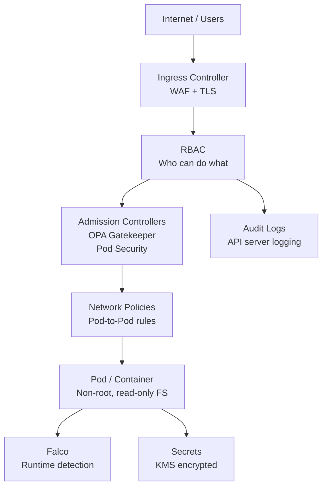

# Kubernetes Security — Complete Guide
### Pod Security, OPA, Falco & Runtime Protection

---

## Table of Contents

1. [Introduction](#introduction)
2. [Kubernetes Security Layers](#kubernetes-security-layers)
3. [Pod Security](#pod-security)
4. [RBAC — Role Based Access Control](#rbac)
5. [Network Policies](#network-policies)
6. [Secrets Management](#secrets-management)
7. [OPA — Open Policy Agent](#opa)
8. [Falco — Runtime Security](#falco)
9. [Image Security](#image-security)
10. [Audit Logging](#audit-logging)
11. [Best Practices](#best-practices)
12. [Production Checklist](#production-checklist)

---

## Introduction

Kubernetes security is not a single feature — it is a layered approach covering the control plane, nodes, workloads, network, and runtime. A misconfigured Kubernetes cluster is one of the most common causes of cloud breaches.

```
Security layers in Kubernetes:

Layer 1 — Infrastructure:  Node hardening, OS patching
Layer 2 — Cluster:         API server auth, RBAC, audit logs
Layer 3 — Network:         Network policies, service mesh
Layer 4 — Workload:        Pod security, image scanning
Layer 5 — Runtime:         Falco, anomaly detection
Layer 6 — Data:            Secret encryption, KMS
```

---

## Kubernetes Security Layers



---

## Pod Security

### Pod Security Admission (PSA) — Kubernetes 1.25+

Pod Security Admission replaced Pod Security Policies (deprecated in 1.21, removed in 1.25). It enforces security standards at the namespace level.

**Three built-in profiles:**

```
Privileged:  No restrictions — for system components only
Baseline:    Prevents known privilege escalations
Restricted:  Hardened — follows pod security best practices
```

### Enable Pod Security at Namespace Level

```yaml
# Apply security standard to a namespace
apiVersion: v1
kind: Namespace
metadata:
  name: production
  labels:
    # Enforce restricted standard — violations are rejected
    pod-security.kubernetes.io/enforce: restricted
    pod-security.kubernetes.io/enforce-version: latest

    # Warn on baseline violations
    pod-security.kubernetes.io/warn: restricted
    pod-security.kubernetes.io/warn-version: latest

    # Audit restricted violations
    pod-security.kubernetes.io/audit: restricted
    pod-security.kubernetes.io/audit-version: latest
```

### Secure Pod Spec — Production Standard

```yaml
apiVersion: apps/v1
kind: Deployment
metadata:
  name: secure-app
  namespace: production
spec:
  replicas: 3
  template:
    spec:
      # Never run as root
      securityContext:
        runAsNonRoot: true
        runAsUser: 1000
        runAsGroup: 3000
        fsGroup: 2000
        seccompProfile:
          type: RuntimeDefault

      # No service account token unless needed
      automountServiceAccountToken: false

      containers:
      - name: app
        image: myapp:1.0@sha256:abc123  # pinned digest
        securityContext:
          allowPrivilegeEscalation: false  # cannot gain more privileges
          readOnlyRootFilesystem: true     # filesystem is read-only
          runAsNonRoot: true
          runAsUser: 1000
          capabilities:
            drop:
              - ALL                        # drop all Linux capabilities
            add:
              - NET_BIND_SERVICE           # only add what is needed

        resources:
          requests:
            memory: "64Mi"
            cpu: "250m"
          limits:
            memory: "128Mi"
            cpu: "500m"

        # Writable volume for temp files if needed
        volumeMounts:
        - name: tmp
          mountPath: /tmp
        - name: cache
          mountPath: /app/cache

      volumes:
      - name: tmp
        emptyDir: {}
      - name: cache
        emptyDir: {}
```

### What Each Security Setting Does

```
runAsNonRoot: true
  Container fails to start if image runs as root
  Prevents root privilege abuse

allowPrivilegeEscalation: false
  Process cannot gain more privileges than parent
  Prevents sudo, SUID binary abuse

readOnlyRootFilesystem: true
  Container filesystem is read-only
  Attacker cannot write malware or modify binaries
  Use emptyDir volumes for writable paths

capabilities: drop: ALL
  Removes all Linux capabilities
  (chown, net_raw, sys_admin etc)
  Add back ONLY what is needed
  NET_BIND_SERVICE — bind to port < 1024

seccompProfile: RuntimeDefault
  Restricts system calls container can make
  Reduces kernel attack surface

automountServiceAccountToken: false
  Pod does not get API server credentials by default
  Add only if pod needs to talk to Kubernetes API
```

---

## RBAC — Role Based Access Control

### RBAC Concepts

```
ServiceAccount — identity for a pod
Role           — permissions within a namespace
ClusterRole    — permissions across all namespaces
RoleBinding    — connects SA to Role (namespace scoped)
ClusterRoleBinding — connects SA to ClusterRole (cluster wide)
```

### Least Privilege Example

```yaml
# ServiceAccount for app
apiVersion: v1
kind: ServiceAccount
metadata:
  name: app-sa
  namespace: production

---
# Role — only what app needs
apiVersion: rbac.authorization.k8s.io/v1
kind: Role
metadata:
  name: app-role
  namespace: production
rules:
# App needs to read its own ConfigMap
- apiGroups: [""]
  resources: ["configmaps"]
  verbs: ["get", "list"]
  resourceNames: ["app-config"]  # only THIS configmap

# App needs to read secrets
- apiGroups: [""]
  resources: ["secrets"]
  verbs: ["get"]
  resourceNames: ["app-secrets"]  # only THIS secret

---
# RoleBinding
apiVersion: rbac.authorization.k8s.io/v1
kind: RoleBinding
metadata:
  name: app-rolebinding
  namespace: production
subjects:
- kind: ServiceAccount
  name: app-sa
  namespace: production
roleRef:
  kind: Role
  apiGroup: rbac.authorization.k8s.io
  name: app-role
```

### Audit RBAC — Find Overpermissioned Accounts

```bash
# List all clusterrolebindings
kubectl get clusterrolebindings -o wide

# Find who has cluster-admin
kubectl get clusterrolebindings \
  -o jsonpath='{range .items[?(@.roleRef.name=="cluster-admin")]}{.metadata.name}{"\n"}'

# Check what a serviceaccount can do
kubectl auth can-i --list \
  --as=system:serviceaccount:production:app-sa \
  -n production

# Use rbac-audit tool
kubectl-rbac-lookup app-sa -n production
```

---

## Network Policies

By default all pods can talk to all other pods. Network Policies restrict this.

### Default Deny All

```yaml
# Apply this to every namespace first
# Then add specific allow rules
apiVersion: networking.k8s.io/v1
kind: NetworkPolicy
metadata:
  name: default-deny-all
  namespace: production
spec:
  podSelector: {}      # applies to ALL pods
  policyTypes:
  - Ingress
  - Egress
```

### Allow Specific Communication

```yaml
# Allow frontend to talk to backend only
apiVersion: networking.k8s.io/v1
kind: NetworkPolicy
metadata:
  name: allow-frontend-to-backend
  namespace: production
spec:
  podSelector:
    matchLabels:
      app: backend        # this policy protects backend pods
  policyTypes:
  - Ingress
  ingress:
  - from:
    - podSelector:
        matchLabels:
          app: frontend   # only frontend pods can talk to backend
    ports:
    - protocol: TCP
      port: 8080

---
# Allow backend to talk to database only
apiVersion: networking.k8s.io/v1
kind: NetworkPolicy
metadata:
  name: allow-backend-to-db
  namespace: production
spec:
  podSelector:
    matchLabels:
      app: database
  policyTypes:
  - Ingress
  ingress:
  - from:
    - podSelector:
        matchLabels:
          app: backend
    ports:
    - protocol: TCP
      port: 5432

---
# Allow pods to reach external APIs (egress)
apiVersion: networking.k8s.io/v1
kind: NetworkPolicy
metadata:
  name: allow-external-egress
  namespace: production
spec:
  podSelector:
    matchLabels:
      app: backend
  policyTypes:
  - Egress
  egress:
  - to:
    - ipBlock:
        cidr: 0.0.0.0/0
        except:
        - 10.0.0.0/8      # block internal ranges
        - 172.16.0.0/12
        - 192.168.0.0/16
    ports:
    - protocol: TCP
      port: 443
```

---

## Secrets Management

### Never Store Secrets in ConfigMaps or Env Vars Directly

```yaml
# WRONG — secret in plain text
env:
- name: DB_PASSWORD
  value: "mysecretpassword"  # visible in pod spec

# WRONG — base64 is not encryption
apiVersion: v1
kind: Secret
metadata:
  name: db-secret
data:
  password: bXlzZWNyZXRwYXNzd29yZA==  # just base64
```

### Use External Secrets Operator with AWS Secrets Manager

```yaml
# ExternalSecret — syncs from AWS Secrets Manager
apiVersion: external-secrets.io/v1beta1
kind: ExternalSecret
metadata:
  name: db-credentials
  namespace: production
spec:
  refreshInterval: 1h
  secretStoreRef:
    name: aws-secrets-store
    kind: SecretStore
  target:
    name: db-credentials  # creates this K8s Secret
  data:
  - secretKey: DB_PASSWORD
    remoteRef:
      key: prod/database/credentials
      property: password
```

```yaml
# SecretStore — connects to AWS
apiVersion: external-secrets.io/v1beta1
kind: SecretStore
metadata:
  name: aws-secrets-store
  namespace: production
spec:
  provider:
    aws:
      service: SecretsManager
      region: ap-south-1
      auth:
        jwt:
          serviceAccountRef:
            name: external-secrets-sa
```

### Enable Encryption at Rest for etcd

```yaml
# /etc/kubernetes/encryption-config.yaml
apiVersion: apiserver.config.k8s.io/v1
kind: EncryptionConfiguration
resources:
- resources:
  - secrets
  providers:
  - aescbc:
      keys:
      - name: key1
        secret: <base64-encoded-32-byte-key>
  - identity: {}  # fallback for unencrypted secrets
```

---

## OPA — Open Policy Agent

OPA is a general-purpose policy engine. In Kubernetes it is deployed as **OPA Gatekeeper** — an admission controller that enforces custom policies.

### How OPA Gatekeeper Works

```
Developer submits: kubectl apply -f pod.yaml
                          │
                          ▼
              Kubernetes API Server
                          │
              Admission Controller webhook
                          │
                          ▼
                   OPA Gatekeeper
              Evaluates pod against policies
                          │
                  Pass    │    Fail
                          │      │
                          ▼      ▼
                      Pod        Rejected with
                    Created      policy violation message
```

### Install OPA Gatekeeper

```bash
# Install via kubectl
kubectl apply -f https://raw.githubusercontent.com/open-policy-agent/gatekeeper/master/deploy/gatekeeper.yaml

# Verify installation
kubectl get pods -n gatekeeper-system
```

### Define a Constraint Template

ConstraintTemplate defines the policy logic in Rego language:

```yaml
# Require all containers to have resource limits
apiVersion: templates.gatekeeper.sh/v1
kind: ConstraintTemplate
metadata:
  name: requireresourcelimits
spec:
  crd:
    spec:
      names:
        kind: RequireResourceLimits
  targets:
  - target: admission.k8s.gatekeeper.sh
    rego: |
      package requireresourcelimits

      violation[{"msg": msg}] {
        container := input.review.object.spec.containers[_]
        not container.resources.limits.memory
        msg := sprintf(
          "Container '%v' must have memory limits set",
          [container.name]
        )
      }

      violation[{"msg": msg}] {
        container := input.review.object.spec.containers[_]
        not container.resources.limits.cpu
        msg := sprintf(
          "Container '%v' must have CPU limits set",
          [container.name]
        )
      }
```

### Create a Constraint (apply the policy)

```yaml
# Apply the policy to production namespace
apiVersion: constraints.gatekeeper.sh/v1beta1
kind: RequireResourceLimits
metadata:
  name: require-resource-limits
spec:
  match:
    kinds:
    - apiGroups: [""]
      kinds: ["Pod"]
    namespaces:
    - production
    - staging
  enforcementAction: deny  # deny or warn or dryrun
```

### Common OPA Policies

```yaml
# Policy 1 — Require non-root
# Block any pod running as root

# Policy 2 — Require read-only root filesystem
# Block pods without readOnlyRootFilesystem: true

# Policy 3 — Block privileged containers
# Block containers with privileged: true

# Policy 4 — Require image digest
# Block images without @sha256: digest
# Ensures you always run exactly what you tested

# Policy 5 — Allowed registries only
# Block images from untrusted registries
```

```yaml
# Example — Block privileged containers
apiVersion: templates.gatekeeper.sh/v1
kind: ConstraintTemplate
metadata:
  name: blockprivilegedcontainers
spec:
  crd:
    spec:
      names:
        kind: BlockPrivilegedContainers
  targets:
  - target: admission.k8s.gatekeeper.sh
    rego: |
      package blockprivilegedcontainers

      violation[{"msg": msg}] {
        container := input.review.object.spec.containers[_]
        container.securityContext.privileged == true
        msg := sprintf(
          "Privileged container not allowed: '%v'",
          [container.name]
        )
      }
```

---

## Falco — Runtime Security

Falco is a cloud-native runtime security tool. While OPA prevents bad configurations at deploy time, Falco detects suspicious behaviour at runtime.

### What Falco Does

```
Falco watches system calls in real time:

Normal: app reads its config file
  → Falco allows silently

Suspicious: app reads /etc/passwd
  → Falco alerts

Attack: app spawns a shell inside container
  → Falco alerts immediately

Critical: app opens network connection
  after reading sensitive file
  → Falco alerts with full context
```

### Install Falco on Kubernetes

```bash
# Using Helm
helm repo add falcosecurity https://falcosecurity.github.io/charts
helm repo update

helm install falco falcosecurity/falco \
  --namespace falco \
  --create-namespace \
  --set falcosidekick.enabled=true \
  --set falcosidekick.webui.enabled=true

# Verify
kubectl get pods -n falco
```

### Falco Rules — Built-in Examples

```yaml
# Built-in rules Falco comes with:

# Rule 1 — Shell spawned in container
- rule: Terminal shell in container
  desc: A shell was spawned in a container
  condition: >
    spawned_process and container
    and shell_procs and proc.tty != 0
    and container_entrypoint
  output: >
    A shell was spawned in a container
    (user=%user.name container=%container.name
     image=%container.image.repository
     shell=%proc.name parent=%proc.pname)
  priority: WARNING

# Rule 2 — Sensitive file read
- rule: Read sensitive file untrusted
  desc: Sensitive file opened for reading
  condition: >
    open_read and sensitive_files
    and not proc.name in (trusted_programs)
    and not container.image.repository in (trusted_images)
  output: >
    Sensitive file opened for reading
    (user=%user.name file=%fd.name
     container=%container.name)
  priority: WARNING

# Rule 3 — Write to /etc directory
- rule: Write below etc
  desc: File written below /etc
  condition: >
    write_etc_dir and not etc_dir_proxy_installer
    and not user_known_write_etc_conditions
  output: >
    File written below /etc
    (user=%user.name command=%proc.cmdline
     file=%fd.name container=%container.name)
  priority: ERROR
```

### Custom Falco Rule — Detect Crypto Mining

```yaml
# Detect common crypto mining processes
- rule: Detect crypto mining
  desc: Cryptocurrency miner process detected
  condition: >
    spawned_process and container and
    (proc.name in (crypto_miners) or
     proc.cmdline contains "stratum+tcp" or
     proc.cmdline contains "xmrig" or
     proc.cmdline contains "minerd")
  output: >
    Crypto mining process detected
    (container=%container.name
     image=%container.image.repository
     command=%proc.cmdline)
  priority: CRITICAL
  tags: [cryptocurrency, mining]
```

### Falco Sidekick — Alerts to Slack/PagerDuty

```yaml
# values.yaml for Helm install
falcosidekick:
  enabled: true
  config:
    slack:
      webhookurl: "https://hooks.slack.com/services/xxx"
      minimumpriority: "warning"
    pagerduty:
      routingkey: "your-pagerduty-key"
      minimumpriority: "critical"
    aws:
      cloudwatchlogs:
        loggroup: "/falco/alerts"
        region: "ap-south-1"
        minimumpriority: "warning"
```

---

## Image Security

### Scan Images Before Deployment

```bash
# Trivy — scan image for vulnerabilities
trivy image myapp:1.0

# Scan with specific severity
trivy image --severity HIGH,CRITICAL myapp:1.0

# Scan and output JSON
trivy image --format json --output trivy-report.json myapp:1.0

# Fail if critical vulnerabilities found
trivy image --exit-code 1 --severity CRITICAL myapp:1.0
```

### Use Image Digest — Not Tags

```yaml
# WRONG — tag can be overwritten silently
image: nginx:latest
image: myapp:1.0

# RIGHT — digest is immutable
image: nginx@sha256:abc123def456...
image: myapp:1.0@sha256:xyz789...

# Get digest
docker pull nginx:1.25
docker inspect nginx:1.25 | jq '.[0].RepoDigests'
```

### OPA Policy — Require Trusted Registry

```yaml
apiVersion: templates.gatekeeper.sh/v1
kind: ConstraintTemplate
metadata:
  name: allowedregistries
spec:
  crd:
    spec:
      names:
        kind: AllowedRegistries
      validation:
        openAPIV3Schema:
          properties:
            allowedRegistries:
              type: array
              items:
                type: string
  targets:
  - target: admission.k8s.gatekeeper.sh
    rego: |
      package allowedregistries

      violation[{"msg": msg}] {
        container := input.review.object.spec.containers[_]
        not startswith(container.image, input.parameters.allowedRegistries[_])
        msg := sprintf(
          "Image '%v' is from an untrusted registry",
          [container.image]
        )
      }
```

```yaml
# Apply the policy
apiVersion: constraints.gatekeeper.sh/v1beta1
kind: AllowedRegistries
metadata:
  name: allowed-registries
spec:
  match:
    kinds:
    - apiGroups: [""]
      kinds: ["Pod"]
  parameters:
    allowedRegistries:
    - "123456789.dkr.ecr.ap-south-1.amazonaws.com"
    - "gcr.io/company-project"
```

---

## Audit Logging

### Enable API Server Audit Logging

```yaml
# /etc/kubernetes/audit-policy.yaml
apiVersion: audit.k8s.io/v1
kind: Policy
rules:
# Log all requests to secrets at RequestResponse level
- level: RequestResponse
  resources:
  - group: ""
    resources: ["secrets"]

# Log pod creation and deletion
- level: Request
  verbs: ["create", "delete", "patch"]
  resources:
  - group: ""
    resources: ["pods"]

# Log RBAC changes
- level: RequestResponse
  resources:
  - group: "rbac.authorization.k8s.io"
    resources: ["*"]

# Minimal logging for read operations
- level: Metadata
  verbs: ["get", "list", "watch"]

# Log nothing for these system accounts
- level: None
  users:
  - system:kube-proxy
  verbs: ["watch"]
  resources:
  - group: ""
    resources: ["endpoints", "services"]
```

---

## Best Practices

```
Control Plane:
  ✅ Enable RBAC — disable anonymous access
  ✅ Use TLS for all API server communication
  ✅ Enable audit logging
  ✅ Restrict etcd access to API server only
  ✅ Enable etcd encryption at rest

Node Security:
  ✅ Keep nodes patched and updated
  ✅ Use minimal OS (Bottlerocket, Flatcar)
  ✅ Disable SSH in production (use SSM)
  ✅ Enable node-level audit logging

Workload Security:
  ✅ Never run containers as root
  ✅ Set readOnlyRootFilesystem: true
  ✅ Drop all capabilities, add only needed
  ✅ Set resource limits on all containers
  ✅ Enable Pod Security Admission (Restricted)
  ✅ Use OPA Gatekeeper for custom policies

Network:
  ✅ Default deny all network policies
  ✅ Only allow required communication
  ✅ Use service mesh (Istio/Linkerd) for mTLS
  ✅ Restrict egress to known destinations

Secrets:
  ✅ Enable etcd encryption
  ✅ Use External Secrets Operator
  ✅ Rotate secrets regularly
  ✅ Never mount secrets as env vars for sensitive data

Runtime:
  ✅ Install Falco for runtime detection
  ✅ Alert on shell spawned in container
  ✅ Alert on sensitive file access
  ✅ Alert on unexpected network connections

Images:
  ✅ Scan images with Trivy in CI/CD
  ✅ Use image digests not tags
  ✅ Only allow approved registries via OPA
  ✅ Use distroless or minimal base images
```

---

## Production Checklist

```
Before deploying to production:
  □ Pod Security Admission set to Restricted
  □ All containers run as non-root
  □ readOnlyRootFilesystem: true on all containers
  □ Resource limits set on all containers
  □ No privileged containers
  □ Capabilities dropped to minimum
  □ Network policies: default deny + specific allows
  □ RBAC: least privilege for all service accounts
  □ automountServiceAccountToken: false where not needed
  □ Secrets in External Secrets / Secrets Manager
  □ etcd encryption enabled
  □ OPA Gatekeeper installed with core policies
  □ Falco installed and alerts configured
  □ Image scanning in CI/CD pipeline
  □ Image digests used in all manifests
  □ Only approved registries in use
  □ Audit logging enabled and shipped to SIEM
  □ Node OS patched and minimal
```

---

*References: Kubernetes Security Documentation | CIS Kubernetes Benchmark | OWASP Kubernetes Security Cheat Sheet | NSA Kubernetes Hardening Guide*
