# DevSecOps Pipeline — Complete Guide
### Security at Every Stage of the Software Delivery Lifecycle

---

## Table of Contents

1. [What is DevSecOps](#what-is-devsecops)
2. [DevSecOps vs DevOps](#devsecops-vs-devops)
3. [The Complete DevSecOps Pipeline](#the-complete-devsecops-pipeline)
4. [Stage 1 — Pre-Commit Security](#stage-1-pre-commit)
5. [Stage 2 — SAST](#stage-2-sast)
6. [Stage 3 — SCA — Dependency Scanning](#stage-3-sca)
7. [Stage 4 — Container Security](#stage-4-container-security)
8. [Stage 5 — IaC Security](#stage-5-iac-security)
9. [Stage 6 — DAST](#stage-6-dast)
10. [Stage 7 — Runtime Security](#stage-7-runtime-security)
11. [Security Gates](#security-gates)
12. [Complete GitHub Actions Pipeline](#complete-github-actions-pipeline)
13. [Security Dashboard and Metrics](#security-dashboard)
14. [Best Practices](#best-practices)

---

## What is DevSecOps

DevSecOps integrates security practices into every phase of the DevOps lifecycle — not as a checkpoint at the end, but as a continuous, automated activity throughout development and operations.

```
Traditional Security:
  Dev → Dev → Dev → QA → SECURITY REVIEW → Production
                              ↑
                    Security finds issues late
                    Expensive to fix
                    Delays release
                    Dev team frustrated

DevSecOps:
  Security at EVERY stage:
  Pre-commit → Build → Test → Deploy → Monitor
      ↑            ↑       ↑       ↑        ↑
    Secrets      SAST    DAST   IaC scan  Runtime
    linting      SCA    Image   Sentinel  Falco
    Hooks        scan   scan    checks    alerts
```

---

## DevSecOps vs DevOps

| Aspect | DevOps | DevSecOps |
|--------|--------|-----------|
| Security timing | End of pipeline | Throughout pipeline |
| Who owns security | Security team | Entire team |
| Security tools | Manual scans | Automated in CI/CD |
| Vulnerability discovery | Late (expensive) | Early (cheap) |
| Compliance | Manual audits | Continuous automated |
| Developer awareness | Low | High |
| Time to fix | Weeks/months | Hours/days |

---

## The Complete DevSecOps Pipeline

```mermaid
graph LR
    IDE[Developer IDE\nPre-commit hooks\nSecret detection]
    Commit[git push\nPR opened]
    SAST[SAST\nSonarQube\nSemgrep]
    SCA[SCA\nSnyk\nOWASP DC]
    Build[Build\nDocker image]
    ContainerScan[Container Scan\nTrivy\nGrype]
    IaCScan[IaC Scan\ntfsec\nCheckov]
    Staging[Deploy to\nStaging]
    DAST[DAST\nOWASP ZAP]
    Production[Deploy to\nProduction]
    Runtime[Runtime\nFalco\nPrisma Cloud]
    Monitor[Monitor\nSIEM\nAlerts]

    IDE --> Commit
    Commit --> SAST
    SAST --> SCA
    SCA --> Build
    Build --> ContainerScan
    ContainerScan --> IaCScan
    IaCScan --> Staging
    Staging --> DAST
    DAST --> Production
    Production --> Runtime
    Runtime --> Monitor
```



---

## Stage 1 — Pre-Commit Security

Pre-commit hooks run security checks on the developer's machine before code is even pushed.

### Install Pre-commit Framework

```bash
# Install pre-commit
pip install pre-commit

# Or homebrew
brew install pre-commit

# Install in repo
pre-commit install

# Run manually against all files
pre-commit run --all-files
```

### Pre-commit Configuration

```yaml
# .pre-commit-config.yaml

repos:
# Detect secrets before commit
- repo: https://github.com/Yelp/detect-secrets
  rev: v1.4.0
  hooks:
  - id: detect-secrets
    args: ['--baseline', '.secrets.baseline']

# Gitleaks — another secret scanner
- repo: https://github.com/zricethezav/gitleaks
  rev: v8.18.0
  hooks:
  - id: gitleaks

# Terraform security
- repo: https://github.com/aquasecurity/tfsec
  rev: v1.28.1
  hooks:
  - id: tfsec

# Checkov IaC scan
- repo: https://github.com/bridgecrewio/checkov
  rev: 3.1.0
  hooks:
  - id: checkov
    args: ['--framework', 'terraform']

# Dockerfile linting
- repo: https://github.com/hadolint/hadolint
  rev: v2.12.0
  hooks:
  - id: hadolint

# General security linting
- repo: https://github.com/PyCQA/bandit
  rev: 1.7.5
  hooks:
  - id: bandit
    args: ['-r', '.', '-ll']

# YAML linting
- repo: https://github.com/adrienverge/yamllint
  rev: v1.32.0
  hooks:
  - id: yamllint

# Kubernetes manifest validation
- repo: https://github.com/instrumenta/kubeval
  rev: v0.16.1
  hooks:
  - id: kubeval
```

### Detect Secrets — Initialize Baseline

```bash
# Create baseline of allowed secrets
detect-secrets scan > .secrets.baseline

# Audit detected secrets
detect-secrets audit .secrets.baseline

# Mark false positives
detect-secrets audit --only-allowlisted .secrets.baseline

# Add to git
git add .secrets.baseline
git commit -m "chore: add secrets baseline"
```

---

## Stage 2 — SAST

Static Application Security Testing analyzes source code without executing it.

### SonarQube Integration

```yaml
# GitHub Actions — SonarQube scan
- name: SonarQube Scan
  uses: SonarSource/sonarqube-scan-action@master
  env:
    SONAR_TOKEN: ${{ secrets.SONAR_TOKEN }}
    SONAR_HOST_URL: ${{ secrets.SONAR_HOST_URL }}
  with:
    args: >
      -Dsonar.projectKey=myapp
      -Dsonar.sources=src
      -Dsonar.qualitygate.wait=true
      -Dsonar.security.hotspots.inheritFromParent=true
```

### Semgrep — Fast SAST

```bash
# Install
pip install semgrep

# Scan with OWASP rules
semgrep --config=p/owasp-top-ten .

# Scan with security rules
semgrep --config=p/security-audit .

# Run in CI
semgrep --config=auto --error .
```

```yaml
# GitHub Actions — Semgrep
- name: Semgrep SAST Scan
  uses: semgrep/semgrep-action@v1
  with:
    config: >-
      p/security-audit
      p/owasp-top-ten
      p/secrets
    publishToken: ${{ secrets.SEMGREP_APP_TOKEN }}
    publishDeployment: true
```

---

## Stage 3 — SCA

Software Composition Analysis scans third-party dependencies for known vulnerabilities.

### Snyk Integration

```yaml
# GitHub Actions — Snyk SCA
- name: Snyk Dependency Scan
  uses: snyk/actions/node@master
  env:
    SNYK_TOKEN: ${{ secrets.SNYK_TOKEN }}
  with:
    args: --severity-threshold=high --fail-on=all

- name: Snyk Container Scan
  uses: snyk/actions/docker@master
  env:
    SNYK_TOKEN: ${{ secrets.SNYK_TOKEN }}
  with:
    image: myapp:${{ github.sha }}
    args: --severity-threshold=high
```

### OWASP Dependency Check

```yaml
- name: OWASP Dependency Check
  uses: dependency-check/Dependency-Check_Action@main
  with:
    project: 'MyApp'
    path: '.'
    format: 'ALL'
    args: >
      --failOnCVSS 7
      --enableRetired

- name: Upload OWASP Report
  uses: actions/upload-artifact@v3
  with:
    name: dependency-check-report
    path: reports/
```

---

## Stage 4 — Container Security

### Trivy — Container Image Scanning

```bash
# Scan image
trivy image myapp:1.0

# Scan with specific severity
trivy image --severity HIGH,CRITICAL myapp:1.0

# Fail build on critical
trivy image --exit-code 1 --severity CRITICAL myapp:1.0

# Scan filesystem
trivy fs .

# Scan Dockerfile
trivy config Dockerfile
```

```yaml
# GitHub Actions — Trivy
- name: Build Docker Image
  run: docker build -t myapp:${{ github.sha }} .

- name: Run Trivy vulnerability scanner
  uses: aquasecurity/trivy-action@master
  with:
    image-ref: myapp:${{ github.sha }}
    format: 'sarif'
    output: 'trivy-results.sarif'
    severity: 'CRITICAL,HIGH'
    exit-code: '1'

- name: Upload Trivy results to GitHub Security
  uses: github/codeql-action/upload-sarif@v2
  if: always()
  with:
    sarif_file: 'trivy-results.sarif'
```

### Secure Dockerfile

```dockerfile
# Use specific digest — not tag
FROM node:18-alpine@sha256:abc123def456

# Create non-root user
RUN addgroup -S appgroup && \
    adduser -S appuser -G appgroup

WORKDIR /app

# Copy package files first (layer caching)
COPY --chown=appuser:appgroup package*.json ./

# Install production dependencies only
RUN npm ci --only=production && \
    npm cache clean --force

# Copy app code
COPY --chown=appuser:appgroup . .

# Switch to non-root
USER appuser

# No sensitive env vars in Dockerfile
# Inject at runtime via Kubernetes secrets

EXPOSE 3000

HEALTHCHECK --interval=30s --timeout=3s \
  CMD wget -qO- http://localhost:3000/health || exit 1

CMD ["node", "server.js"]
```

---

## Stage 5 — IaC Security

```yaml
# GitHub Actions — IaC Security
- name: Run tfsec
  uses: aquasecurity/tfsec-action@v1.0.0
  with:
    minimum_severity: HIGH

- name: Run Checkov
  uses: bridgecrewio/checkov-action@master
  with:
    directory: ./infrastructure
    framework: terraform
    soft_fail: false
    output_format: sarif
    output_file_path: checkov.sarif

- name: Kubesec — Kubernetes manifest security
  run: |
    docker run -i kubesec/kubesec:512c5e0 scan - < k8s/deployment.yaml

- name: Polaris — Kubernetes best practices
  run: |
    docker run --rm \
      -v $(pwd)/k8s:/manifests \
      quay.io/fairwinds/polaris:latest \
      polaris audit --audit-path /manifests \
      --format sarif \
      --output-file polaris.sarif
```

---

## Stage 6 — DAST

```yaml
# GitHub Actions — OWASP ZAP DAST
- name: Deploy to Staging
  run: |
    kubectl apply -f k8s/staging/
    kubectl rollout status deployment/myapp -n staging
    sleep 30

- name: OWASP ZAP Baseline Scan
  uses: zaproxy/action-baseline@v0.10.0
  with:
    target: 'https://staging.example.com'
    rules_file_name: '.zap/rules.tsv'
    cmd_options: '-l Medium'
    fail_action: true

- name: OWASP ZAP API Scan
  uses: zaproxy/action-api-scan@v0.7.0
  with:
    target: 'https://staging.example.com/api/openapi.json'
    format: openapi
    fail_action: true
```

---

## Stage 7 — Runtime Security

### Falco Alerts to Slack

```yaml
# falco-values.yaml
falco:
  rules_file:
    - /etc/falco/falco_rules.yaml
    - /etc/falco/k8s_audit_rules.yaml
    - /etc/falco/rules.d

falcosidekick:
  enabled: true
  config:
    slack:
      webhookurl: "https://hooks.slack.com/services/xxx"
      minimumpriority: warning
      messageformat: >
        *Falco Alert* :rotating_light:
        *Rule:* {{ .rule }}
        *Priority:* {{ .priority }}
        *Container:* {{ .output_fields.container.name }}
        *Image:* {{ .output_fields.container.image.repository }}
        *Command:* {{ .output_fields.proc.cmdline }}
```

---

## Security Gates

Security gates define what fails a build at each stage.

```
Gate 1 — Pre-commit:
  FAIL if: any secret detected in code
  FAIL if: Dockerfile has critical issues
  FAIL if: Terraform has HIGH findings

Gate 2 — SAST:
  FAIL if: SonarQube Quality Gate fails
  FAIL if: Critical security hotspot found
  FAIL if: Semgrep finds HIGH severity issue

Gate 3 — SCA:
  FAIL if: Dependency with CVSS >= 9.0
  WARN if: Dependency with CVSS >= 7.0

Gate 4 — Container:
  FAIL if: CRITICAL CVE in container image
  FAIL if: Container runs as root
  WARN if: HIGH CVE in container image

Gate 5 — IaC:
  FAIL if: tfsec HIGH finding
  FAIL if: Checkov HIGH finding
  WARN if: MEDIUM findings

Gate 6 — DAST:
  FAIL if: High risk finding in ZAP scan
  WARN if: Medium risk finding
  Allow: Low and Informational

Gate 7 — Production gate:
  FAIL if: ANY unresolved High from previous gates
  REQUIRE: Security team sign-off for Critical changes
```

---

## Complete GitHub Actions Pipeline

```yaml
# .github/workflows/devsecops.yml
name: DevSecOps Pipeline

on:
  push:
    branches: [main, develop]
  pull_request:
    branches: [main]

env:
  IMAGE_NAME: myapp
  REGISTRY: 123456789.dkr.ecr.ap-south-1.amazonaws.com

jobs:
  # ─── STAGE 1: SAST ─────────────────────────────
  sast:
    name: Static Analysis
    runs-on: ubuntu-latest
    steps:
      - uses: actions/checkout@v3
        with:
          fetch-depth: 0

      - name: Detect Secrets
        run: |
          pip install detect-secrets
          detect-secrets scan --baseline .secrets.baseline

      - name: Semgrep SAST
        uses: semgrep/semgrep-action@v1
        with:
          config: p/security-audit p/owasp-top-ten p/secrets
          publishToken: ${{ secrets.SEMGREP_APP_TOKEN }}

      - name: SonarQube Scan
        uses: SonarSource/sonarqube-scan-action@master
        env:
          SONAR_TOKEN: ${{ secrets.SONAR_TOKEN }}
          SONAR_HOST_URL: ${{ secrets.SONAR_HOST_URL }}

  # ─── STAGE 2: SCA ──────────────────────────────
  sca:
    name: Dependency Scanning
    runs-on: ubuntu-latest
    steps:
      - uses: actions/checkout@v3

      - name: Snyk SCA
        uses: snyk/actions/node@master
        env:
          SNYK_TOKEN: ${{ secrets.SNYK_TOKEN }}
        with:
          args: --severity-threshold=high

      - name: OWASP Dependency Check
        uses: dependency-check/Dependency-Check_Action@main
        with:
          project: MyApp
          path: .
          format: HTML
          args: --failOnCVSS 9

  # ─── STAGE 3: BUILD + CONTAINER SCAN ───────────
  build-and-scan:
    name: Build and Container Scan
    runs-on: ubuntu-latest
    needs: [sast, sca]
    outputs:
      image-digest: ${{ steps.build.outputs.digest }}
    steps:
      - uses: actions/checkout@v3

      - name: Configure AWS credentials
        uses: aws-actions/configure-aws-credentials@v2
        with:
          role-to-assume: ${{ secrets.AWS_ROLE_ARN }}
          aws-region: ap-south-1

      - name: Login to ECR
        uses: aws-actions/amazon-ecr-login@v1

      - name: Build image
        id: build
        run: |
          docker build \
            -t $REGISTRY/$IMAGE_NAME:${{ github.sha }} \
            --label "git-commit=${{ github.sha }}" \
            .
          echo "digest=$(docker inspect --format='{{index .RepoDigests 0}}' $REGISTRY/$IMAGE_NAME:${{ github.sha }})" >> $GITHUB_OUTPUT

      - name: Trivy container scan
        uses: aquasecurity/trivy-action@master
        with:
          image-ref: ${{ env.REGISTRY }}/${{ env.IMAGE_NAME }}:${{ github.sha }}
          format: sarif
          output: trivy.sarif
          severity: CRITICAL,HIGH
          exit-code: 1

      - name: Upload Trivy results
        uses: github/codeql-action/upload-sarif@v2
        if: always()
        with:
          sarif_file: trivy.sarif

      - name: Push to ECR
        if: success()
        run: |
          docker push $REGISTRY/$IMAGE_NAME:${{ github.sha }}

  # ─── STAGE 4: IaC SCAN ─────────────────────────
  iac-scan:
    name: Infrastructure Security
    runs-on: ubuntu-latest
    steps:
      - uses: actions/checkout@v3

      - name: tfsec scan
        uses: aquasecurity/tfsec-action@v1.0.0
        with:
          minimum_severity: HIGH
          format: sarif
          out: tfsec.sarif

      - name: Checkov scan
        uses: bridgecrewio/checkov-action@master
        with:
          directory: .
          soft_fail: false
          output_format: sarif
          output_file_path: checkov.sarif

      - name: Upload IaC scan results
        uses: github/codeql-action/upload-sarif@v2
        if: always()
        with:
          sarif_file: tfsec.sarif

  # ─── STAGE 5: DEPLOY STAGING + DAST ───────────
  staging-and-dast:
    name: Staging Deployment and DAST
    runs-on: ubuntu-latest
    needs: [build-and-scan, iac-scan]
    if: github.ref == 'refs/heads/main'
    steps:
      - uses: actions/checkout@v3

      - name: Deploy to staging
        run: |
          kubectl set image deployment/myapp \
            myapp=$REGISTRY/$IMAGE_NAME:${{ github.sha }} \
            -n staging
          kubectl rollout status deployment/myapp -n staging
          sleep 30

      - name: OWASP ZAP Baseline Scan
        uses: zaproxy/action-baseline@v0.10.0
        with:
          target: 'https://staging.example.com'
          fail_action: true
          cmd_options: '-l Medium'

      - name: OWASP ZAP API Scan
        uses: zaproxy/action-api-scan@v0.7.0
        with:
          target: 'https://staging.example.com/openapi.json'
          format: openapi

  # ─── STAGE 6: PRODUCTION DEPLOYMENT ───────────
  production:
    name: Production Deployment
    runs-on: ubuntu-latest
    needs: [staging-and-dast]
    if: github.ref == 'refs/heads/main'
    environment:
      name: production
      url: https://app.example.com
    steps:
      - name: Deploy to production
        run: |
          kubectl set image deployment/myapp \
            myapp=$REGISTRY/$IMAGE_NAME:${{ github.sha }} \
            -n production
          kubectl rollout status deployment/myapp -n production

      - name: Production baseline scan
        uses: zaproxy/action-baseline@v0.10.0
        with:
          target: 'https://app.example.com'
          fail_action: false  # alert only on production
```

---

## Security Dashboard and Metrics

### Key Security Metrics to Track

```
Mean Time to Detect (MTTD):
  How long to find a vulnerability after it's introduced
  Target: < 1 hour (automated scanning)

Mean Time to Remediate (MTTR):
  How long to fix after detection
  Target: Critical < 24hr, High < 1 week

Vulnerability Escape Rate:
  % of vulnerabilities that reach production
  Target: 0% for Critical, < 5% for High

Security Gate Pass Rate:
  % of builds that pass all security gates
  Target: > 95% (lower means too many issues OR too strict gates)

False Positive Rate:
  % of alerts that are not real issues
  Target: < 20% (too many frustrates developers)

Coverage:
  % of repos with security scanning enabled
  Target: 100%
```

---

## Best Practices

```
Culture:
  ✅ Security is everyone's responsibility
  ✅ Developers trained on secure coding
  ✅ Security champions in each team
  ✅ Blameless security postmortems
  ✅ Celebrate security wins

Automation:
  ✅ Every repo has pre-commit hooks
  ✅ Every PR triggers security scans
  ✅ Security gates block bad code
  ✅ Alerts go to the right people
  ✅ Reports are actionable not overwhelming

Process:
  ✅ Threat modelling for new features
  ✅ Security requirements in Definition of Done
  ✅ Pen test quarterly
  ✅ Dependency updates in regular sprints
  ✅ Security debt tracked like tech debt

Tools:
  ✅ Use SARIF format for all tools
  ✅ Centralise findings in GitHub Security or Defect Dojo
  ✅ Tune false positives regularly
  ✅ Update tool versions monthly
  ✅ Review and update policies quarterly
```

---

*References: OWASP DevSecOps Guideline | NIST DevSecOps Framework | GitLab DevSecOps Report | CNCF Security Whitepaper*
