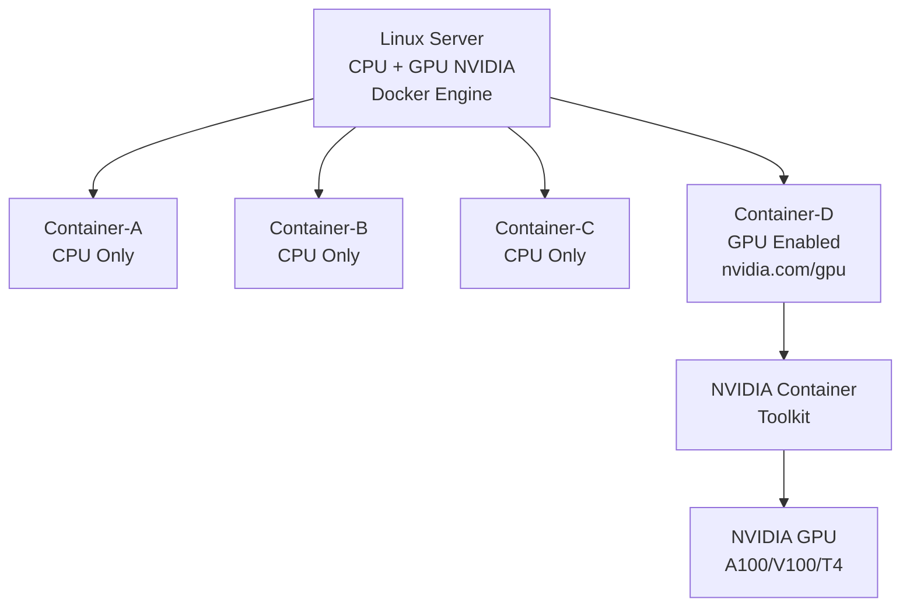

# Running GPU Containers with Docker — Complete Production Guide
### NVIDIA, CUDA, Container Toolkit & Multi-GPU Workloads

---

## Table of Contents

1. [Scenario](#scenario)
2. [Architecture](#architecture)
3. [Step 1 — Verify GPU on Host](#step-1-verify-gpu)
4. [Step 2 — Install NVIDIA Drivers](#step-2-install-drivers)
5. [Step 3 — Install Docker](#step-3-install-docker)
6. [Step 4 — Install NVIDIA Container Toolkit](#step-4-container-toolkit)
7. [Step 5 — Configure Docker Runtime](#step-5-configure-runtime)
8. [Step 6 — Verify Docker GPU Support](#step-6-verify)
9. [Step 7 — Deploy GPU Container](#step-7-deploy)
10. [Multi-GPU Workloads](#multi-gpu)
11. [Docker Compose GPU Deployment](#docker-compose)
12. [Monitoring GPU Usage](#monitoring)
13. [Security Best Practices](#security)
14. [Common Errors](#common-errors)
15. [Kubernetes GPU Workloads](#kubernetes-gpu)
16. [Production Checklist](#checklist)
17. [Interview Questions](#interview)

---

## Scenario

### Current State

```
Server
├── CPU
├── GPU (NVIDIA)
└── Docker Engine

Container-A (CPU) ✅ running
Container-B (CPU) ✅ running
Container-C (CPU) ✅ running
```

### Requirement

```
Deploy Container-D on GPU
while existing containers continue running on CPU
```

The challenge is that Docker does not automatically expose GPUs to containers. You must set up the NVIDIA runtime explicitly.

---

## Architecture



---

## Step 1 — Verify GPU on Host

### Check GPU Exists

```bash
# Check PCI devices for NVIDIA GPU
lspci | grep -i nvidia

# Expected output:
# 00:1e.0 3D controller: NVIDIA Corporation A100 80GB PCIe (rev a1)
```

### Check NVIDIA Driver

```bash
nvidia-smi
```

Expected output:

```
+-----------------------------------------------------------------------------+
| NVIDIA-SMI 525.89.02    Driver Version: 525.89.02    CUDA Version: 12.0    |
|-------------------------------+----------------------+----------------------+
| GPU  Name        Persistence-M| Bus-Id        Disp.A | Volatile Uncorr. ECC|
| Fan  Temp  Perf  Pwr:Usage/Cap|         Memory-Usage | GPU-Util  Compute M.|
|===============================+======================+======================|
|   0  NVIDIA A100-SXM...  Off  | 00000000:00:1E.0 Off |                    0|
| N/A   28C    P0    51W / 400W |      0MiB / 81920MiB |      0%      Default|
+-----------------------------------------------------------------------------+
```

If this fails — install driver first (Step 2).

---

## Step 2 — Install NVIDIA Drivers

### Ubuntu / Debian

```bash
# Update packages
sudo apt update

# Auto-install recommended driver
sudo ubuntu-drivers autoinstall

# OR install specific version
sudo apt install nvidia-driver-525

# Reboot required
sudo reboot

# Verify after reboot
nvidia-smi
```

### RHEL / CentOS

```bash
# Add NVIDIA repo
sudo dnf config-manager \
  --add-repo https://developer.download.nvidia.com/compute/cuda/repos/rhel8/x86_64/cuda-rhel8.repo

# Install driver
sudo dnf install -y nvidia-driver nvidia-settings

# Reboot
sudo reboot

# Verify
nvidia-smi
```

---

## Step 3 — Install Docker

```bash
# Ubuntu
sudo apt update
sudo apt install -y docker.io

# Or using official Docker repo
curl -fsSL https://get.docker.com | bash

# Start Docker
sudo systemctl enable docker
sudo systemctl start docker

# Verify
docker version
docker info
```

---

## Step 4 — Install NVIDIA Container Toolkit

The NVIDIA Container Toolkit bridges the NVIDIA driver on the host with containers. Without this, `--gpus` flag does not work.

```bash
# Step 1 — Add GPG key
curl -fsSL https://nvidia.github.io/libnvidia-container/gpgkey | \
  sudo gpg --dearmor -o \
  /usr/share/keyrings/nvidia-container-toolkit-keyring.gpg

# Step 2 — Add repository
curl -s -L \
  https://nvidia.github.io/libnvidia-container/stable/deb/nvidia-container-toolkit.list | \
  sed 's#deb https://#deb [signed-by=/usr/share/keyrings/nvidia-container-toolkit-keyring.gpg] https://#g' | \
  sudo tee /etc/apt/sources.list.d/nvidia-container-toolkit.list

# Step 3 — Install toolkit
sudo apt update
sudo apt install -y nvidia-container-toolkit

# Verify installation
nvidia-ctk --version
```

---

## Step 5 — Configure Docker Runtime

```bash
# Configure Docker to use NVIDIA runtime
sudo nvidia-ctk runtime configure --runtime=docker

# This modifies /etc/docker/daemon.json:
cat /etc/docker/daemon.json
# {
#   "runtimes": {
#     "nvidia": {
#       "path": "nvidia-container-runtime",
#       "runtimeArgs": []
#     }
#   }
# }

# Restart Docker to apply
sudo systemctl restart docker

# Verify Docker is running
sudo systemctl status docker
```

---

## Step 6 — Verify Docker GPU Support

```bash
# Test GPU access from Docker container
docker run --rm \
  --gpus all \
  nvidia/cuda:12.3.1-base-ubuntu22.04 \
  nvidia-smi
```

Expected output inside container:

```
+-----------------------------------------------------------------------------+
| NVIDIA-SMI 525.89.02    Driver Version: 525.89.02    CUDA Version: 12.3    |
|-------------------------------+----------------------+----------------------+
|   0  NVIDIA A100         Off  | 00000000:00:1E.0 Off |                   0 |
+-----------------------------------------------------------------------------+
```

**Success** — Docker can access GPU.

---

## Step 7 — Deploy GPU Container

### Run GPU Container

```bash
# All GPUs
docker run -d \
  --name ai-app \
  --gpus all \
  my-ai-image:latest

# Verify container is running
docker ps | grep ai-app

# Check GPU is accessible inside container
docker exec -it ai-app nvidia-smi
```

---

## Multi-GPU Workloads

### Use Specific GPU by Index

```bash
# Use GPU 0 only
docker run -d \
  --gpus '"device=0"' \
  --name model-a \
  my-ai-image:latest

# Use GPU 1 only
docker run -d \
  --gpus '"device=1"' \
  --name model-b \
  my-ai-image:latest

# Use GPU 2 only
docker run -d \
  --gpus '"device=2"' \
  --name model-c \
  my-ai-image:latest
```

### Use Specific GPU by UUID

```bash
# Get GPU UUIDs
nvidia-smi -L
# GPU 0: NVIDIA A100 (UUID: GPU-abc123)
# GPU 1: NVIDIA A100 (UUID: GPU-def456)

# Use GPU by UUID
docker run -d \
  --gpus '"device=GPU-abc123"' \
  my-ai-image:latest
```

### Environment Variable Approach

```bash
# Show all GPUs
docker run -e NVIDIA_VISIBLE_DEVICES=all my-ai-image

# Only GPU 0
docker run -e NVIDIA_VISIBLE_DEVICES=0 my-ai-image

# GPUs 0 and 1
docker run -e NVIDIA_VISIBLE_DEVICES=0,1 my-ai-image

# Disable GPU (CPU only)
docker run -e NVIDIA_VISIBLE_DEVICES=none my-ai-image
```

### Multi-GPU Assignment Table

| Container | GPU Assignment | Command |
|-----------|---------------|---------|
| model-a | GPU 0 | `--gpus '"device=0"'` |
| model-b | GPU 1 | `--gpus '"device=1"'` |
| model-c | GPU 2 | `--gpus '"device=2"'` |
| inference | All GPUs | `--gpus all` |
| api | No GPU | (no --gpus flag) |

---

## Docker Compose GPU Deployment

### Basic GPU Compose

```yaml
# docker-compose.yml
version: "3.9"

services:
  ai-model:
    image: my-ai-image:latest
    deploy:
      resources:
        reservations:
          devices:
            - driver: nvidia
              count: 1           # number of GPUs
              capabilities:
                - gpu
    environment:
      MODEL_PATH: /models
    volumes:
      - ./models:/models:ro
```

```bash
# Run
docker compose up -d

# Verify GPU access
docker compose exec ai-model nvidia-smi
```

### Production Docker Compose — Mixed CPU + GPU

```yaml
# docker-compose.yml
version: "3.9"

services:

  # CPU containers — no GPU config
  api:
    image: backend-api:latest
    ports:
      - "8080:8080"
    environment:
      DB_HOST: postgres
    networks:
      - app-network
    restart: unless-stopped

  worker:
    image: cpu-worker:latest
    environment:
      QUEUE_URL: redis://redis:6379
    networks:
      - app-network
    restart: unless-stopped

  # GPU container
  ai-model:
    image: gpu-model:latest
    deploy:
      resources:
        reservations:
          devices:
            - driver: nvidia
              count: 1
              capabilities:
                - gpu
    environment:
      MODEL_PATH: /models
      CUDA_VISIBLE_DEVICES: "0"
    volumes:
      - model-weights:/models:ro
    networks:
      - app-network
    restart: unless-stopped

  # Infrastructure
  postgres:
    image: postgres:15-alpine
    environment:
      POSTGRES_PASSWORD_FILE: /run/secrets/db_password
    networks:
      - app-network

  redis:
    image: redis:7-alpine
    networks:
      - app-network

networks:
  app-network:
    driver: bridge

volumes:
  model-weights:
    driver: local
```

Result:

```
api    → CPU  ✅
worker → CPU  ✅
ai-model → GPU 0 ✅
```

---

## Monitoring GPU Usage

### Real-time GPU Monitoring

```bash
# Watch GPU utilization every 1 second
watch -n 1 nvidia-smi

# Watch specific metrics
nvidia-smi --query-gpu=utilization.gpu,utilization.memory,memory.used,memory.free,temperature.gpu \
  --format=csv --loop=1

# Output:
# utilization.gpu [%], utilization.memory [%], memory.used [MiB], memory.free [MiB], temperature.gpu
# 87 %, 62 %, 50234 MiB, 31686 MiB, 52
```

### GPU Metrics with Prometheus

```bash
# Install DCGM Exporter for Prometheus
docker run -d \
  --gpus all \
  --cap-add SYS_ADMIN \
  -p 9400:9400 \
  nvcr.io/nvidia/k8s/dcgm-exporter:3.1.7-3.1.4-ubuntu20.04

# Prometheus config
scrape_configs:
  - job_name: 'gpu-metrics'
    static_configs:
      - targets: ['localhost:9400']
```

---

## Security Best Practices

### Never Use Privileged Mode for GPU

```bash
# WRONG — exposes everything on host ❌
docker run --privileged my-ai-image

# RIGHT — only GPU access ✅
docker run --gpus all my-ai-image
```

### Secure GPU Dockerfile

```dockerfile
FROM nvidia/cuda:12.3.1-runtime-ubuntu22.04

# Update security patches
RUN apt-get update && \
    apt-get upgrade -y && \
    apt-get install -y --no-install-recommends \
      python3 python3-pip && \
    rm -rf /var/lib/apt/lists/*

# Create non-root user
RUN useradd -m -u 1000 appuser

WORKDIR /app

COPY requirements.txt .
RUN pip install --no-cache-dir -r requirements.txt

COPY --chown=appuser:appuser . .

# Switch to non-root
USER appuser

CMD ["python3", "app.py"]
```

### Restrict GPU Access per Container

```bash
# CPU containers — no GPU flag = no GPU access
docker run nginx          # no GPU
docker run postgres:15    # no GPU

# GPU containers — explicit GPU assignment
docker run --gpus '"device=0"' my-ai-image  # only GPU 0
```

---

## Common Errors

### Error 1 — Device Driver Not Found

```
Error response from daemon:
could not select device driver "" with capabilities: [[gpu]]
```

**Cause:** NVIDIA Container Toolkit not installed or Docker runtime not configured.

**Fix:**

```bash
# Install toolkit
sudo apt install -y nvidia-container-toolkit

# Configure Docker
sudo nvidia-ctk runtime configure --runtime=docker

# Restart Docker
sudo systemctl restart docker
```

---

### Error 2 — nvidia-smi Not Found

```
docker: Error response from daemon:
nvidia-smi: command not found
```

**Cause:** NVIDIA driver not installed on host.

**Fix:**

```bash
# Install driver
sudo ubuntu-drivers autoinstall
sudo reboot

# Verify
nvidia-smi
```

---

### Error 3 — No CUDA Device Detected

```
RuntimeError: No CUDA-capable device is detected
```

**Cause:** GPU not exposed to container.

**Fix:**

```bash
# Add --gpus flag
docker run --gpus all my-ai-image
```

---

### Error 4 — GPU Already in Use

```
CUDA error: all CUDA-capable devices are busy or unavailable
```

**Cause:** GPU memory fully consumed by another container.

**Fix:**

```bash
# Check GPU memory usage
nvidia-smi

# Kill process using GPU
# Find container using the GPU
docker ps

# Stop the container consuming GPU
docker stop <container-id>
```

---

## Kubernetes GPU Workloads

### Step 1 — Create GPU Node Group (EKS)

```bash
# EKS GPU node group
aws eks create-nodegroup \
  --cluster-name production \
  --nodegroup-name gpu-nodes \
  --node-role arn:aws:iam::123:role/NodeRole \
  --ami-type AL2_x86_64_GPU \
  --instance-types g5.xlarge \
  --scaling-config minSize=0,maxSize=5,desiredSize=1
```

### Step 2 — Install NVIDIA Device Plugin

```bash
kubectl apply -f https://raw.githubusercontent.com/NVIDIA/k8s-device-plugin/master/nvidia-device-plugin.yml

# Verify
kubectl get pods -n kube-system | grep nvidia
kubectl describe node gpu-node | grep nvidia.com/gpu
```

### Step 3 — Deploy GPU Workload

```yaml
# gpu-deployment.yaml
apiVersion: apps/v1
kind: Deployment
metadata:
  name: ai-model
  namespace: production
spec:
  replicas: 1
  selector:
    matchLabels:
      app: ai-model
  template:
    metadata:
      labels:
        app: ai-model
    spec:
      # Schedule only on GPU nodes
      nodeSelector:
        accelerator: nvidia-gpu

      tolerations:
      - key: nvidia.com/gpu
        operator: Exists
        effect: NoSchedule

      containers:
      - name: ai-model
        image: my-ai-image:1.0

        resources:
          requests:
            cpu: "2"
            memory: "8Gi"
            nvidia.com/gpu: "1"    # request 1 GPU
          limits:
            cpu: "4"
            memory: "16Gi"
            nvidia.com/gpu: "1"    # limit 1 GPU

        env:
        - name: CUDA_VISIBLE_DEVICES
          value: "0"
```

```bash
# Label GPU node
kubectl label nodes gpu-node-1 accelerator=nvidia-gpu

# Taint GPU node (optional — forces only GPU workloads)
kubectl taint nodes gpu-node-1 nvidia.com/gpu=present:NoSchedule

# Deploy
kubectl apply -f gpu-deployment.yaml

# Verify pod is on GPU node
kubectl get pods -o wide
kubectl exec -it ai-model-xxx -- nvidia-smi
```

---

## Production Checklist

```
Host Setup:
  □ NVIDIA GPU physically installed and detected
  □ NVIDIA Driver installed (verify: nvidia-smi works)
  □ Docker Engine installed and running
  □ NVIDIA Container Toolkit installed
  □ Docker runtime configured (nvidia-ctk runtime configure)
  □ Docker restarted after configuration

Verification:
  □ docker run --gpus all nvidia/cuda nvidia-smi succeeds
  □ GPU visible inside test container
  □ GPU memory and utilization visible in nvidia-smi

Deployment:
  □ Container started with --gpus flag or docker-compose gpu config
  □ Correct GPU assigned (specific device or all)
  □ Non-GPU containers running without --gpus flag
  □ GPU container using non-root user
  □ No --privileged flag used

Monitoring:
  □ watch -n 1 nvidia-smi shows GPU utilization
  □ Alerts configured for GPU memory exhaustion
  □ Alerts configured for GPU temperature
  □ Logging configured for GPU container

Security:
  □ Non-root user in Dockerfile
  □ No --privileged flag
  □ Specific GPU assigned (not all if multi-GPU server)
  □ Resource limits set
```

---

## Interview Questions

### Q: How would you deploy a GPU-based AI application using Docker?

**Answer:**

*"First I verify the NVIDIA GPU is present on the host using lspci and nvidia-smi. Then I install the NVIDIA Container Toolkit — this is what bridges the host GPU driver with Docker containers. After installing, I configure Docker runtime with nvidia-ctk runtime configure --runtime=docker and restart Docker. I verify GPU access works by running a test container with docker run --gpus all nvidia/cuda nvidia-smi. For the actual deployment I run the container with --gpus all for all GPUs or --gpus device=0 for a specific GPU. CPU containers run without any --gpus flag so they have no GPU access. I monitor GPU utilization with watch -n 1 nvidia-smi and set up Prometheus with DCGM Exporter for production monitoring."*

### Q: How do you share GPUs between multiple containers?

**Answer:**

*"On a multi-GPU server I assign specific GPUs to specific containers using --gpus '"device=0"' for GPU 0, --gpus '"device=1"' for GPU 1, and so on. Each container gets a dedicated GPU with no sharing. If I need to time-share a single GPU, I use NVIDIA MPS — Multi-Process Service — which allows multiple processes to share a single GPU context. For Kubernetes I request nvidia.com/gpu: 1 in the resource limits and the NVIDIA device plugin handles scheduling."*

---

*References: NVIDIA Container Toolkit Documentation | NVIDIA Docker GitHub | NVIDIA Kubernetes Device Plugin | CUDA Container Documentation*
