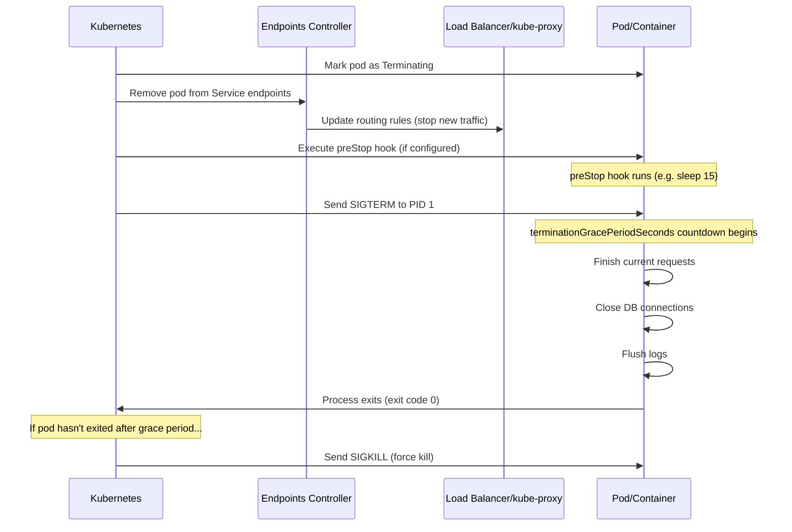

# Kubernetes Graceful Shutdown — Complete Production & Interview Guide
### SIGTERM, SIGKILL, terminationGracePeriodSeconds & Zero Downtime

---

## Table of Contents

1. [Introduction](#introduction)
2. [Common Misconception](#misconception)
3. [What Happens During Pod Termination](#termination-flow)
4. [SIGTERM vs SIGKILL](#signals)
5. [Configuration](#configuration)
6. [preStop Hook](#prestop)
7. [Readiness Probes](#readiness-probes)
8. [Graceful Shutdown During Rolling Updates](#rolling-updates)
9. [Application-Level Implementation](#application-code)
10. [Production Best Practices](#best-practices)
11. [Interview Questions](#interview-questions)
12. [Memory Trick](#memory-trick)

---

## Introduction

In production Kubernetes environments, pods are terminated during:
- Rolling updates (new deployment)
- Rollbacks
- Node drains (`kubectl drain`)
- Scale down events
- Pod deletion (`kubectl delete pod`)

**Graceful Shutdown** is the process of ensuring running requests are not lost when a pod terminates.

```
Without Graceful Shutdown:
  User request is processing
      │
  Pod killed immediately
      │
  Request lost
      │
  User gets 500 Error ❌

With Graceful Shutdown:
  User request is processing
      │
  Pod receives SIGTERM
      │
  Pod stops accepting new requests
      │
  Existing request completes
      │
  Pod exits cleanly ✅
```

---

## Common Misconception

> *"Graceful Shutdown is a new feature in Kubernetes v1.34"*

**This is incorrect.**

Graceful pod termination has existed in Kubernetes for many years — since the very early versions. Recent Kubernetes releases have improved:
- Endpoint termination handling
- Pod lifecycle management
- Draining behavior

But graceful shutdown itself is not new. Every Kubernetes cluster you use today already has it.

---

## What Happens During Pod Termination

Kubernetes follows a specific sequence when terminating a pod. Understanding this sequence is critical for production reliability.



### Step by Step

**Step 1 — Pod Marked as Terminating**

```
Pod status transitions:
  Running → Terminating
```

The pod still exists and processes are still running at this point.

**Step 2 — Remove from Service Endpoints**

```
Kubernetes removes the pod IP from the Service endpoint list

Before: Service → Pod-1, Pod-2, Pod-3
After:  Service → Pod-1, Pod-2  (Pod-3 removed)

Result: No new traffic sent to this pod
        In-flight requests still being processed
```

> ⚠️ **Important:** There is a small propagation delay between pod removal from endpoints and kube-proxy updating iptables rules on nodes. The `preStop` sleep hook compensates for this.

**Step 3 — preStop Hook Executes (if configured)**

```yaml
lifecycle:
  preStop:
    exec:
      command: ["sleep", "15"]
```

This runs BEFORE SIGTERM. The 15-second sleep gives load balancers and kube-proxy time to propagate the endpoint removal before the application starts shutting down.

**Step 4 — SIGTERM Sent**

Kubernetes sends `SIGTERM` to PID 1 inside the container. The application must handle this signal to shut down gracefully.

**Step 5 — Grace Period**

```yaml
terminationGracePeriodSeconds: 30  # default
```

The pod has this many seconds to exit cleanly. During this time it should:
- Finish processing current requests
- Close database connections
- Flush log buffers
- Save any necessary state

**Step 6 — SIGKILL (if needed)**

If the pod has not exited after the grace period:

```
SIGKILL sent
Process immediately killed
No cleanup possible
Cannot be caught or ignored
```

---

## SIGTERM vs SIGKILL

Understanding these two Linux signals is fundamental — Kubernetes, Docker, systemd, and Linux all use them.

### What is a Signal?

A signal is an asynchronous notification sent to a process by the kernel or another process.

### SIGTERM (Signal 15)

```bash
# Send SIGTERM
kill PID
# or
kill -15 PID
# or
kill -SIGTERM PID
```

**Meaning:** Please shut down gracefully.

The process receives this signal and CAN:
- Finish current work
- Close files and sockets
- Flush write buffers
- Save state
- Close database connections
- Log shutdown message
- Exit with a clean exit code

```bash
# Bash script handling SIGTERM
#!/bin/bash

cleanup() {
    echo "SIGTERM received — cleaning up"
    # do cleanup here
    exit 0
}

trap cleanup SIGTERM

echo "Running..."
while true; do
    sleep 1
done
```

### SIGKILL (Signal 9)

```bash
# Send SIGKILL
kill -9 PID
# or
kill -SIGKILL PID
```

**Meaning:** Stop immediately. No questions.

The Linux **kernel** kills the process instantly. The process:
- ❌ Cannot catch SIGKILL
- ❌ Cannot ignore SIGKILL
- ❌ Cannot handle SIGKILL
- ❌ Cannot do any cleanup

```
SIGKILL → Process Dead (immediately)
```

### Comparison Table

| Feature | SIGTERM (15) | SIGKILL (9) |
|---------|-------------|-------------|
| Signal number | 15 | 9 |
| Graceful shutdown | ✅ Yes | ❌ No |
| Cleanup possible | ✅ Yes | ❌ No |
| Can be caught | ✅ Yes | ❌ No |
| Can be ignored | ✅ Yes | ❌ No |
| Sent by | Kubernetes, Docker, systemctl | Kubernetes (last resort), `kill -9` |
| Production usage | First choice | Last resort only |

### Kubernetes Termination Flow

```
Pod termination ordered
        │
        ▼
SIGTERM sent to container
        │
        ▼
terminationGracePeriodSeconds countdown
        │
Container exits cleanly? ──── YES ──→ Pod deleted ✅
        │
        NO
        │
        ▼
SIGKILL sent
        │
        ▼
Container force killed ❌
(requests dropped, data possibly corrupted)
```

---

## Configuration

### Default Behavior (No Configuration)

Even with a minimal pod spec:

```yaml
spec:
  containers:
  - name: app
    image: myapp:1.0
```

Kubernetes automatically:
- ✅ Sends SIGTERM
- ✅ Waits 30 seconds
- ✅ Sends SIGKILL if still running

### Explicitly Configure Grace Period

```yaml
apiVersion: apps/v1
kind: Deployment
metadata:
  name: myapp
spec:
  template:
    spec:
      terminationGracePeriodSeconds: 60  # explicit configuration
      containers:
      - name: app
        image: myapp:1.0
```

### Choose the Right Grace Period

```
Short grace period (15-30s):
  Stateless APIs
  Simple request-response services
  Fast shutdown applications

Medium grace period (60-120s):
  Most web applications
  APIs with database writes
  Applications with connection pooling

Long grace period (5-30 minutes):
  File upload services
  Video processing
  Long-running transactions
  Batch job completion

Rule:
  Set grace period > your longest expected request duration
  + time for connection draining
  + safety buffer
```

**Example calculation:**

```
Longest request: 45 seconds (file upload)
Connection drain: 10 seconds
Safety buffer:    5 seconds
───────────────────────────
Total:           60 seconds

terminationGracePeriodSeconds: 60
```

---

## preStop Hook

The `preStop` hook runs BEFORE Kubernetes sends SIGTERM. It is critical for avoiding dropped requests during load balancer propagation delays.

### Why preStop Sleep is Needed

```
Timeline without preStop:

T+0s: Pod marked terminating
T+0s: SIGTERM sent to application
T+0s: Application starts shutting down
T+2s: kube-proxy finally updates iptables
      (endpoint removal propagated)
T+2s: Still sending traffic to shutting-down pod
      → 500 errors ❌

Timeline with preStop sleep:

T+0s: Pod marked terminating, endpoints removed
T+0s: preStop sleep starts (15 seconds)
T+15s: kube-proxy has propagated endpoint removal
T+15s: No more new traffic coming in
T+15s: SIGTERM sent — application shuts down
T+15s: Zero requests in flight → clean shutdown ✅
```

### preStop Hook Examples

```yaml
# Simple sleep — most common pattern
lifecycle:
  preStop:
    exec:
      command: ["sleep", "15"]

# NGINX graceful drain
lifecycle:
  preStop:
    exec:
      command:
      - /bin/sh
      - -c
      - nginx -s quit; while killall -0 nginx; do sleep 1; done

# HTTP hook — call a shutdown endpoint
lifecycle:
  preStop:
    httpGet:
      path: /shutdown
      port: 8080
      scheme: HTTP
```

### Complete Production Deployment

```yaml
apiVersion: apps/v1
kind: Deployment
metadata:
  name: production-app
  namespace: production
spec:
  replicas: 3
  strategy:
    type: RollingUpdate
    rollingUpdate:
      maxUnavailable: 0   # never reduce capacity during update
      maxSurge: 1         # one extra pod during update
  selector:
    matchLabels:
      app: production-app
  template:
    metadata:
      labels:
        app: production-app
    spec:
      # Explicit grace period
      terminationGracePeriodSeconds: 60

      containers:
      - name: app
        image: myapp:1.0

        # Readiness probe — traffic only when ready
        readinessProbe:
          httpGet:
            path: /health/ready
            port: 8080
          initialDelaySeconds: 5
          periodSeconds: 5
          failureThreshold: 3

        # Liveness probe — restart if unhealthy
        livenessProbe:
          httpGet:
            path: /health/live
            port: 8080
          initialDelaySeconds: 30
          periodSeconds: 10

        # preStop hook for clean drain
        lifecycle:
          preStop:
            exec:
              command: ["sleep", "15"]

        resources:
          requests:
            cpu: "250m"
            memory: "256Mi"
          limits:
            cpu: "500m"
            memory: "512Mi"
```

---

## Readiness Probes

Readiness probes and graceful shutdown work together to achieve zero-downtime deployments.

### Why Readiness Probes Matter

```
Rolling update without readiness probe:

Old pod:    [Running]  ──────────── [Terminating]
New pod:    [Starting] → [Running] (traffic sent immediately)

Problem: "Running" doesn't mean "ready to serve traffic"
         JVM warmup, database connection pool init,
         cache warming — all take time
         New pod gets traffic before it can handle it → errors

Rolling update WITH readiness probe:

Old pod:    [Running]  ─────────────────── [Terminating]
New pod:    [Starting] → [NotReady] → [Ready] (traffic starts)
                              ↑
                    Traffic only starts here
                    After probe passes
```

### Readiness Probe Failure During Shutdown

When SIGTERM is received, your application can deliberately fail the readiness probe to signal it is no longer accepting traffic:

```python
# Python Flask — stop readiness probe when shutting down
import signal
from flask import Flask, jsonify

app = Flask(__name__)
shutting_down = False

@app.route('/health/ready')
def readiness():
    if shutting_down:
        return jsonify({'status': 'shutting_down'}), 503
    return jsonify({'status': 'ready'}), 200

def handle_sigterm(signum, frame):
    global shutting_down
    shutting_down = True  # fail readiness probe
    # continue processing existing requests
    # exit when done
    
signal.signal(signal.SIGTERM, handle_sigterm)
```

---

## Application-Level Implementation

### Node.js

```javascript
const express = require('express');
const app = express();

let server;
let isShuttingDown = false;

// Graceful shutdown handler
function gracefulShutdown() {
  console.log('SIGTERM received — starting graceful shutdown');
  isShuttingDown = true;

  // Stop accepting new connections
  server.close(() => {
    console.log('HTTP server closed');

    // Close database connections
    db.end(() => {
      console.log('Database connections closed');
      process.exit(0);
    });
  });

  // Force exit if graceful shutdown takes too long
  setTimeout(() => {
    console.error('Forced shutdown after timeout');
    process.exit(1);
  }, 45000);  // 45 seconds (less than grace period)
}

process.on('SIGTERM', gracefulShutdown);

server = app.listen(3000, () => {
  console.log('Server ready on port 3000');
});
```

### Python (FastAPI)

```python
import signal
import asyncio
from fastapi import FastAPI
from contextlib import asynccontextmanager
import uvicorn

app = FastAPI()
is_shutting_down = False

@asynccontextmanager
async def lifespan(app: FastAPI):
    # Startup
    await db.connect()
    yield
    # Shutdown
    await db.disconnect()

@app.get("/health/ready")
async def readiness():
    if is_shutting_down:
        return {"status": "shutting_down"}, 503
    return {"status": "ready"}

def handle_sigterm(signum, frame):
    global is_shutting_down
    is_shutting_down = True
    # uvicorn handles connection draining

signal.signal(signal.SIGTERM, handle_sigterm)
```

### Java (Spring Boot)

```java
// application.yml
server:
  shutdown: graceful  # enable graceful shutdown

spring:
  lifecycle:
    timeout-per-shutdown-phase: 30s
```

```java
// Spring Boot 2.3+ — just configure properties
// Spring handles SIGTERM automatically with graceful shutdown
// All in-flight requests complete before shutdown
// New requests rejected during shutdown phase
```

### Go

```go
package main

import (
    "context"
    "log"
    "net/http"
    "os"
    "os/signal"
    "syscall"
    "time"
)

func main() {
    srv := &http.Server{Addr: ":8080"}

    go func() {
        if err := srv.ListenAndServe(); err != http.ErrServerClosed {
            log.Fatal(err)
        }
    }()

    // Listen for SIGTERM
    quit := make(chan os.Signal, 1)
    signal.Notify(quit, syscall.SIGTERM, syscall.SIGINT)
    <-quit

    log.Println("SIGTERM received — shutting down gracefully")

    // Give in-flight requests 30 seconds to complete
    ctx, cancel := context.WithTimeout(context.Background(), 30*time.Second)
    defer cancel()

    if err := srv.Shutdown(ctx); err != nil {
        log.Fatal("Server forced to shutdown:", err)
    }

    log.Println("Server exited cleanly")
}
```

---

## Graceful Shutdown During Rolling Updates

```yaml
# Deployment strategy for zero downtime
strategy:
  type: RollingUpdate
  rollingUpdate:
    maxUnavailable: 0   # always maintain full capacity
    maxSurge: 1         # allow one extra pod during update
```

### Rolling Update Flow

```
Initial state:
  Pod-1 (v1) Running ← 33% traffic
  Pod-2 (v1) Running ← 33% traffic
  Pod-3 (v1) Running ← 34% traffic

Step 1: New pod starts
  Pod-1 (v1) Running
  Pod-2 (v1) Running
  Pod-3 (v1) Running
  Pod-4 (v2) Starting (not ready yet, no traffic)

Step 2: New pod ready
  Pod-1 (v1) Running ← 25% traffic
  Pod-2 (v1) Running ← 25% traffic
  Pod-3 (v1) Running ← 25% traffic
  Pod-4 (v2) Running ← 25% traffic

Step 3: Old pod terminates gracefully
  Pod-1 (v1) Terminating (SIGTERM, finishes requests)
  Pod-2 (v1) Running ← 33% traffic
  Pod-3 (v1) Running ← 33% traffic
  Pod-4 (v2) Running ← 34% traffic

Repeat for Pod-2 and Pod-3:
  Final state:
  Pod-4 (v2) Running ← 33%
  Pod-5 (v2) Running ← 33%
  Pod-6 (v2) Running ← 34%

Result: ZERO downtime ✅
```

---

## Production Best Practices

```
Always configure:
  ✅ terminationGracePeriodSeconds: 60
     (appropriate for your workload)

  ✅ readinessProbe
     (traffic only when ready, stop traffic on shutdown)

  ✅ livenessProbe
     (restart if unhealthy)

  ✅ preStop sleep: 15
     (compensate for endpoint propagation delay)

Handle SIGTERM in application:
  ✅ Stop accepting new requests
  ✅ Finish current requests
  ✅ Close database connections
  ✅ Flush log buffers
  ✅ Exit cleanly (exit code 0)

Rolling update strategy:
  ✅ maxUnavailable: 0
     (never reduce capacity during update)
  ✅ maxSurge: 1
     (one extra pod during update)

Avoid:
  ❌ kill -9 inside containers unless absolutely necessary
  ❌ terminationGracePeriodSeconds: 0
     (instant kill, no cleanup)
  ❌ Ignoring SIGTERM in application code
  ❌ Missing readiness probe
     (traffic hits pod before it is ready)
```

---

## Interview Questions

### Q1 — What is Graceful Shutdown in Kubernetes?

**Answer:**

*"Graceful shutdown is the process where Kubernetes removes a pod from service endpoints to stop new traffic, sends SIGTERM to the container, waits for the configured grace period, and allows the application to finish processing in-flight requests before termination. If the application does not exit within the grace period, Kubernetes sends SIGKILL and force-kills it. The key is that the application must handle SIGTERM — stop accepting new requests, complete current ones, close database connections, and exit cleanly."*

---

### Q2 — Does Kubernetes automatically provide graceful shutdown?

**Answer:**

*"Yes — Kubernetes automatically sends SIGTERM and waits 30 seconds by default. But Kubernetes does not know when your application's current requests are finished — that is the application's responsibility. If your application ignores SIGTERM and just keeps running, Kubernetes will send SIGKILL after the grace period and force-kill it, dropping any in-flight requests. Graceful shutdown requires both Kubernetes configuration and application-level SIGTERM handling."*

---

### Q3 — What happens if the application ignores SIGTERM?

**Answer:**

*"After terminationGracePeriodSeconds expires — default 30 seconds — Kubernetes sends SIGKILL. SIGKILL cannot be caught, ignored, or handled. The process is immediately killed by the kernel. Any in-flight requests are dropped, database connections are forcibly closed, and data in write buffers may be lost. This is why every production application must implement SIGTERM handling — it is the difference between a clean shutdown and potential data loss."*

---

### Q4 — Why do we need Readiness Probes with Graceful Shutdown?

**Answer:**

*"Readiness probes serve two purposes in graceful shutdown. First, during deployment, they ensure traffic only goes to pods that are fully initialized — JVM warmup, database pool initialization, cache warming all take time after a pod starts. Without readiness probes, traffic hits a pod that is not yet ready and users see errors. Second, during shutdown, the application can deliberately fail the readiness probe when SIGTERM is received, signaling to Kubernetes to stop sending traffic immediately. This gives the pod time to finish existing requests without receiving new ones."*

---

### Q5 — What is the difference between SIGTERM and SIGKILL?

**Answer:**

*"SIGTERM is signal 15 — a polite request to shut down. The process receives it and can catch it, decide how to handle it, do cleanup, and exit gracefully. SIGKILL is signal 9 — an immediate termination order sent by the kernel. The process cannot catch it, cannot ignore it, and has zero time for cleanup. In Kubernetes, SIGTERM is always sent first. SIGKILL is only sent if the process has not exited within terminationGracePeriodSeconds. Never use kill -9 in production unless a process is truly stuck."*

---

### Q6 — Is Graceful Shutdown new in Kubernetes v1.34?

**Answer:**

*"No. Graceful pod termination has been in Kubernetes since the very early versions. The SIGTERM → wait → SIGKILL flow, terminationGracePeriodSeconds, preStop hooks — all of these are long-standing features. Recent Kubernetes releases have improved endpoint termination handling and pod lifecycle behavior, making the propagation more reliable, but the core graceful shutdown mechanism itself is not new."*

---

## Memory Trick

```
SIGTERM    = "Please stop gracefully"
             Application can cleanup
             Can be caught and handled

SIGKILL    = "Stop right now, no discussion"
             Kernel kills immediately
             Cannot be caught

terminationGracePeriodSeconds = "Time for cleanup"
             How long Kubernetes waits after SIGTERM
             Before sending SIGKILL

preStop    = "Before SIGTERM, do this first"
             Gives load balancer time to stop sending traffic
             Compensates for propagation delay

Readiness Probe = "Am I ready to receive traffic?"
             Traffic starts only when probe passes
             Application fails probe during shutdown

Graceful Shutdown = "Finish what you started, then stop"
             Stop accepting new → finish current → exit
```

---

## Final Interview Answer

*"To achieve graceful shutdown in Kubernetes, I configure readinessProbe so traffic only goes to ready pods, set terminationGracePeriodSeconds to a value greater than my longest expected request duration, add a preStop sleep hook of 15 seconds to compensate for endpoint propagation delay, and ensure the application handles SIGTERM correctly — stopping new request acceptance, completing in-flight requests, closing database connections, and exiting cleanly. During deployment rollbacks, node drains, or scaling events, Kubernetes removes the pod from service endpoints, waits for the preStop hook, sends SIGTERM, waits for the grace period, and only sends SIGKILL if the process has not exited. With maxUnavailable: 0 and maxSurge: 1 in the rolling update strategy, capacity is always maintained throughout the process, achieving zero downtime."*

---

*References: Kubernetes Pod Lifecycle Documentation | Kubernetes Graceful Node Shutdown | Linux Signal Man Pages | Container Best Practices — Google Cloud*
