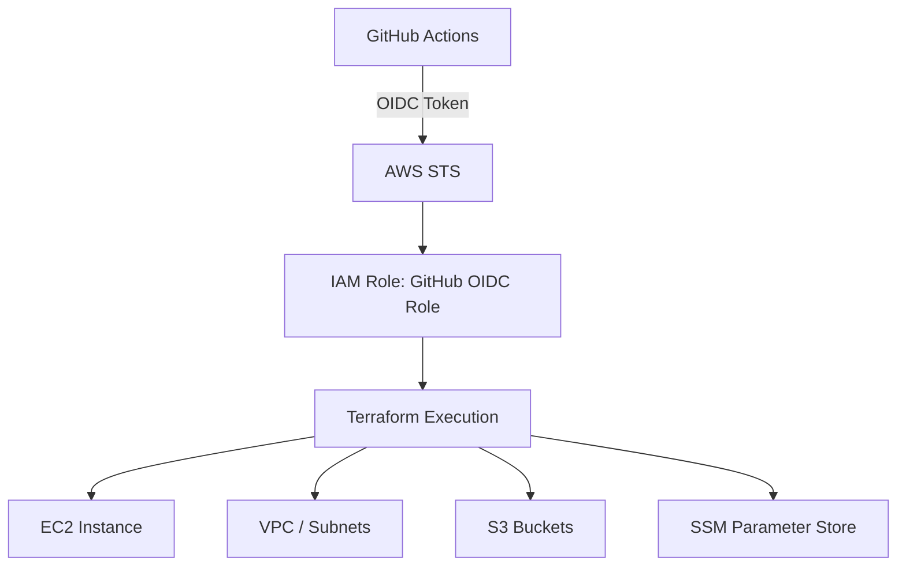

# 🚀 Terraform DevOps CI/CD (GitHub OIDC + AWS)

A production-grade **Terraform CI/CD pipeline** using:

- 🔐 GitHub OIDC — No AWS secrets required
- ☁️ AWS EC2 / VPC / S3 provisioning
- 🔒 Secure outputs via SSM Parameter Store
- ⚙️ GitHub Actions automation
- 📦 Terraform modular architecture

---

## 🧠 Architecture Overview



---

## 🔐 Security Model — No Secrets!

Instead of storing long-lived AWS credentials:

| ❌ Avoid | ✅ Use Instead |
|----------|---------------|
| `AWS_ACCESS_KEY_ID` | GitHub OIDC Token |
| `AWS_SECRET_ACCESS_KEY` | Temporary STS Credentials |
| Static IAM user keys | IAM Role trust policy |

Authentication is handled entirely via **short-lived, automatically rotated tokens** — nothing sensitive ever touches your repository.

---

## 📁 Project Structure

```text
Terraform_Devops/
│
├── main.tf
├── variables.tf
├── providers.tf
├── outputs.tf
├── backend.tf
│
├── modules/
│   ├── ec2/
│   └── vpc/
│
└── .github/
    └── workflows/
        └── terraform.yml
```

---

## 🔐 AWS OIDC Setup

### 1. Create the OIDC Provider

**Provider URL:**
```
https://token.actions.githubusercontent.com
```

**Audience:**
```
sts.amazonaws.com
```

---

### 2. IAM Role Trust Policy

```json
{
  "Version": "2012-10-17",
  "Statement": [
    {
      "Effect": "Allow",
      "Principal": {
        "Federated": "arn:aws:iam::<ACCOUNT_ID>:oidc-provider/token.actions.githubusercontent.com"
      },
      "Action": "sts:AssumeRoleWithWebIdentity",
      "Condition": {
        "StringEquals": {
          "token.actions.githubusercontent.com:aud": "sts.amazonaws.com"
        },
        "StringLike": {
          "token.actions.githubusercontent.com:sub": "repo:sainupopzienz/Terraform_Devops:*"
        }
      }
    }
  ]
}
```

---

## 🛡️ IAM Permissions

### EC2

```json
{
  "Effect": "Allow",
  "Action": "ec2:*",
  "Resource": "*"
}
```

### VPC

```json
{
  "Effect": "Allow",
  "Action": [
    "ec2:CreateVpc",
    "ec2:DeleteVpc",
    "ec2:DescribeVpc*",
    "ec2:CreateSubnet",
    "ec2:DeleteSubnet"
  ],
  "Resource": "*"
}
```

### S3

```json
{
  "Effect": "Allow",
  "Action": [
    "s3:CreateBucket",
    "s3:PutObject",
    "s3:GetObject",
    "s3:ListBucket"
  ],
  "Resource": "*"
}
```

### SSM — Secure Outputs

```json
{
  "Effect": "Allow",
  "Action": [
    "ssm:PutParameter",
    "ssm:GetParameter"
  ],
  "Resource": "*"
}
```

---

## 📤 Secure Output Strategy — No CI Log Leaks

Terraform outputs (like EC2 IPs) are **never printed to CI logs**. Instead, they're encrypted and stored in AWS SSM Parameter Store:

```hcl
resource "aws_ssm_parameter" "ec2_ip" {
  name      = "/dev/ec2/public_ip"
  type      = "SecureString"
  value     = aws_instance.ec2.public_ip
  overwrite = true
}
```

### Retrieve at any time

```bash
aws ssm get-parameter \
  --name "/dev/ec2/public_ip" \
  --with-decryption
```

---

## ⚙️ GitHub Actions CI/CD Pipeline

```yaml
name: Terraform OIDC Pipeline

on:
  push:
    branches: [main]
  pull_request:

permissions:
  id-token: write
  contents: read

jobs:
  terraform:
    runs-on: ubuntu-latest

    env:
      TF_VAR_region: ap-south-1
      TF_VAR_environment: dev

    steps:
      - name: Checkout code
        uses: actions/checkout@v4

      - name: Configure AWS Credentials (OIDC)
        uses: aws-actions/configure-aws-credentials@v4
        with:
          role-to-assume: ${{ secrets.AWS_ROLE_ARN }}
          aws-region: ap-south-1

      - name: Setup Terraform
        uses: hashicorp/setup-terraform@v3

      - name: Terraform Init
        run: terraform init

      - name: Terraform Validate
        run: terraform validate

      - name: Terraform Plan
        run: terraform plan

      - name: Terraform Apply
        if: github.ref == 'refs/heads/main'
        run: terraform apply -auto-approve
```

---

## 🔄 CI/CD Flow

### On Pull Request

```
Code Push → OIDC Auth → Terraform Plan (no apply)
```

### On Merge to Main

```
Code Merge → OIDC Auth → Plan → Apply → SSM Output Storage
```

---

## 🔥 Key Features

| Feature | Status |
|--------|--------|
| No AWS credentials stored in repo | ✅ |
| Secure OIDC authentication | ✅ |
| EC2 + VPC + S3 provisioning | ✅ |
| Encrypted output storage (SSM) | ✅ |
| Branch-safe CI/CD (plan-only on PRs) | ✅ |
| Production-ready architecture | ✅ |

---

## 🚀 Roadmap & Future Improvements

- 🌍 **Multi-environment** setup (dev / stage / prod)
- 📦 **Terraform remote backend** — S3 + DynamoDB state locking
- 🔎 **Security scanning** — `tfsec`, `checkov`
- 💰 **Cost estimation** — Infracost integration
- 📡 **Drift detection** pipeline
- 🚦 **Manual approval gates** for production deploys
- 💬 **Slack notifications** on deployment events

---

## ⭐ Summary

This project demonstrates a **real-world DevSecOps Terraform pipeline** — keyless, secure, and production-ready from day one.

> Built with GitHub OIDC + AWS STS + Terraform + GitHub Actions.
> No secrets. No leaks. No compromises.

---

*Generated with ❤️ for the DevOps community*
